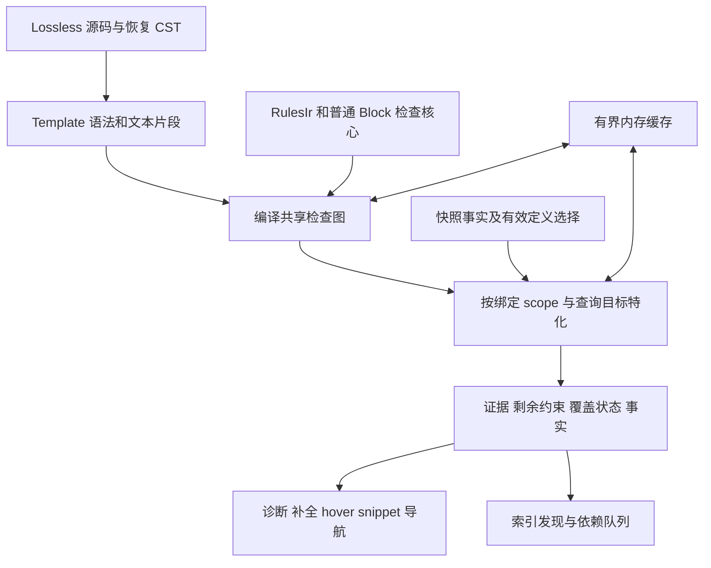

# Template 语义与分析重设计方案

2026 年 10 月 4 日修订。状态：实施中；共享程序、关系反解和结构检查切片已接入，完整阶段出口仍在验收。实现分支：`codex/template-redesign`。

早期复核基线为 `cbd6c6a`，并计入 `c25f4f8` 的 scripted 参数诊断与补全修复；本轮补全与消费契约复核基于 `2f2b93e` 的源码及工作区提案。本文替代原提案；统一概念名为 `Template`，辅助接口的具体签名在实施 PR 中确定。源码事实、设计决定和需要游戏实验确认的行为分别列明；本文不把分析器的现有行为当作 EU4 引擎规范。

## 评审结论与修订理由

认同原方案的主方向：保留带来源的文本替换表示，把与调用无关的工作编译为共享检查图，再按绑定和作用域特化；诊断、补全、hover、snippet 与索引共同读取该模型。认同保留动态键依赖、区分同一位置的重载与不同位置的约束、完整检查拼接容器，以及显式返回分析完成状态。

原方案还不能直接作为实施契约。以下修订解决事实漂移和关键设计缺口：

| 核对项或需要补足的契约 | 修订与理由 |
| --- | --- |
| `dynamic_rules` 推导旧式参数使用行，清理列表包含 `dynamic_constraints` | 当前 `dynamic_rules` 主要推导参数存在要求；`dynamic_constraints` 已移除。替换清单按实际消费者列出 |
| 历史 quoted 漏报与首位置补全问题需要在小修后更新 | 本次小修已覆盖这些行为；保留回归，不重复列为待实施功能 |
| 修改索引时升级独立 schema，快照 schema 为 23 | 项目已统一以 LSP release version 判定持久化兼容性；按现有发布与缓存约定迁移 |
| 原型工作量已注明局限，但缺少本修订中的复跑证据 | 只保留为历史方向性证据；新实现需要同语义、同完成状态的实测 |
| 现有 engine 缓存的能力边界未展开 | 当前是按域失效的有界结果缓存，不具备每条读取依赖的自动追踪或跨请求求解去重；必须实现所需机制 |
| 原稿要求保留次数与来源，尚未定义实例与输出预算 | 分开语义计算、容器出现次数和来源实例，补充数量摘要、实例路径与投影预算 |
| 引用的定义变化会使缓存失效 | 还要记录查找失败、候选集合、覆盖优先级、源根和查询模式；新增定义也能改变旧结果 |
| 覆盖状态的查询边界和 Unknown 组合规则不够具体 | 增加逐查询覆盖范围、三值组合规则、限制原因及消费者的发布契约 |
| 原稿已拒绝直接按 SCC 判环，但摘要固定点的抽象域尚未定义 | 区分潜在调用回边、实际替换状态重复和摘要求解循环；明确单调条件与非单调重建 |
| 复用当前 scope 逻辑时，运行时 `OR` 的合并策略未单独审计 | `Any` 只表达一个源位置的合法解释；运行时 `OR` 内的各个语句仍接受静态合法性检查 |
| 跨 token 替换缺少 lossless 表示契约 | 当前 token 树缺少完整 trivia、错误节点与文本边界；语义参照与慢路径必须保留 lossless 源片段 |
| trait 与内部模型使用不同名称 | 将 `Callable` 规则能力、脚本模型和所有相关查询统一为 `Template`；命名迁移与共享核心纳入同一重设计 |
| mission quoted 目标、现有大小写约定与引擎证据未充分区分 | 分开记录项目目标、现有实现和引擎证据；不使用其他 Paradox 游戏文档代替 EU4 验证 |
| 上轮把命名统一与 quoted 收窄推迟为可选工作 | 按明确的用户决定，两者均为本次默认切换的必达条件；可以分 PR 实施，但不能在验收后继续保留旧概念或通用 quoted 消费 |
| Missing、Empty、Hole 已区分，但存在性与值知识仍易混淆 | 分开存在状态与文本状态；明确 Present Hole 激活正向存在条件 |
| 参数候选的正确性容易被误解成整次调用有效 | 按焦点约束验证候选，缺少无关必填参数仍允许补全；整次调用另外报告缺失 |
| `Any` 的通过证据不足以决定后续 scope 和索引事实 | 分开接受见证与分支状态，保留普通检查的选择规则，不把一个成功分支的事实当成所有解释的共同事实 |
| 共享 matcher 只抽出 SymbolFacts 会丢掉工作区能力 | 增加编辑器无关的只读解析接口，涵盖资产、链接、定义选择和相关依赖 |
| 事实工作队列缺少可执行的非收敛处理 | 按隔离轮次从基础声明重建受影响组件，记录生成依据；检测震荡并返回未完成状态 |
| 来源或候选输出不足会污染语义完成状态 | 分开语义检查、事实发现与结果投影的覆盖；已证明结论不因 UI 输出预算耗尽而被抹掉 |
| 拼接补全只有原则，缺少可执行算法 | 按调用与光标特化，采用有限候选逆映射、单变量重复拼接反解、关联约束与结构重解析 |
| 多孔洞分别生成候选后求交会丢失关联 | 在所有相关位置共享同一绑定见证，先组合关系再投影焦点；不能暗中补齐缺失实参 |
| “共用模型”尚未覆盖全部现有语言功能 | 固定按需查询与结果契约，纳入 semantic tokens、scope inlay、symbols、resolve 和代码修复 |
| 只约束完整性不足以防止长期降级 | 按有限场景、编辑轨迹和真实语料验收完成率；普通支持场景持续 Unknown 也是切换阻塞 |
| 性能验收只看求解时间会漏掉交互阻塞 | 同时记录排队、来源投影、协议编码、取消与索引并发；基础共享和预算前移到核心阶段 |

## 目标与可验收的完备性

目标是一个尽可能完备、性能可控的 Template 语义系统，供全部现有 LSP 功能按需消费。参数类型只是关系约束的显示摘要；补全、诊断、hover 和索引不能分别定义参数的意义。统一的是语义表示、规则选择、证据与来源，不要求每个请求都计算一个包含所有功能结果的巨大对象。

| 维度 | 验收契约 |
| --- | --- |
| 表示覆盖 | 所有已采用的文本替换位置都有表示或带来源的恢复节点；不能因定义在替换前不符合普通脚本语法而丢弃整份 Template |
| 结论可靠 | 已证明 Valid/Invalid 的结论与采用的语义及独立参照一致；未知事实、条件、搜索截断均不得伪装成证明 |
| 有限问题完整 | 在声明的有限候选域、确定绑定及足够预算内，与独立穷举的候选集合和调用结论一致；“枚举完成”必须说明枚举的域及来源 |
| 开放文本支持 | 自由 Scalar、新定义名、任意脚本没有可穷尽的有限建议列表；仍能验证具体输入、提供有依据的建议及残余约束，不将建议列表冒充完整合法值域 |
| 跨功能一致 | 同一快照、绑定、scope、消费模式下，各功能引用同一证据；查询范围或假设不同造成的差异必须可解释 |
| 编辑正确 | 补全、rename、quick fix 写回原文件后满足其承诺；不越过不可逆来源边界，不损坏其他绑定使用或文本编码 |
| 交互可用 | 常规支持场景能够在测量确定的预算内完成；病理输入可以有界退出，但不能用普遍 Unknown 或候选截断换取性能达标 |

不承诺任意文本增长、任意关联未知量和递归组合都在固定时间内穷尽求解。每阶段维护“已支持且应完成、条件依赖、语义待确认、实现缺口、资源不足”的分类及 owned 见证。后三类不能仅以统一的 Unknown 数量掩盖；已经列入支持范围的普通场景未完成，必须作为缺陷或切换阻塞解释。

## 已确定的统一命名与消费契约

本轮用户明确要求统一名称，并要求 quoted 只能由模板消费。以下是本次重设计的实施范围与验收条件，替代上轮“保留 Callable/mission quoted 支持、以后再独立决定”的安排。

脚本模板统一命名为 **Template**。命名 `scripted_effect`、命名 `scripted_trigger` 与被模板消费的 quoted 内容使用同一表示、编译图和查询入口；差异由来源、入口 schema、绑定环境与消费位置表达。命名与匿名只是同一 `Template` 的来源属性，不建立独立的 Callable、QuotedScript、Payload 分析模型。EU4 的 `scripted_effect`/`scripted_trigger` 拼写及 effect/trigger schema 名称继续表达游戏类别。

| 现有名称或概念 | 统一后的契约 |
| --- | --- |
| 规则 trait `Callable` 及其 `body` schema 实现数据 | trait 改为 `Template`，以 `Template { body: … }` 声明入口 schema；不保留长期双名或别名 |
| 命名 scripted 定义 | `Template`，来源为有效的命名定义，入口 schema 由类型的 Template 实现提供 |
| quoted script / 参数 payload | 在实际 Template 脚本消费点建立匿名 `Template`，来源为实参；body/items 是消费模式，不是另一种语言或公开类型 |
| callable/replacement replay 与 scripted 专用动态查询 | 合并到 Template 编译、特化与查询职责，模块/API/用户说明采用 `template` / `Template*` 命名 |
| `Matcher::Template`、`TemplatePart` 等字面量匹配模式 | 改称 `Matcher::Pattern`、`PatternPart`，相关 matcher、scope link 与静态文本模式术语同步；行为不变，避免占用脚本 Template 的概念名 |
| `quoted<schema>` 及通用 Quoted matcher/value/shape | 删除；普通规则不能声明“把字符串按脚本 schema 解析” |
| 引号 token、字符串编解码与源码映射 | 保留为文本/语法工具；不赋予普通字符串独立的脚本消费能力 |

普通 Block 是语法与容器结构，Scalar 是输入的文本视图；它们不是新的模板品牌，也不需要改掉通用 parser 的结构名。Template 内部按消费位置使用这些结构。静态字符串模式与 localisation 绑定的文本模式不是脚本执行模板，相关命名审计必须区分职责，不能只做全库文本替换。

**quoted 的限制针对脚本消费，不禁止普通带引号字符串。** 普通 `log = "文字"` 等字段继续按 Scalar 检查；字符串包含大括号也不会自动变成脚本。普通 mission `trigger`/`effect` 只接受大括号 Block，直接 quoted script 被拒绝。仅仅位于 Template body 内也不赋予普通字段 quoted 消费能力：普通字段仍遵循自身 Scalar/Block 规则。

只有共享核心确定某个实参在 Template 的脚本内容位置被读取后，才解码其文本并建立匿名 Template。该消费上下文至少包含父 Template 身份、绑定身份、源使用点、目标 schema、scope、body/items 模式及父容器位置；它由 Template 语义节点产生，普通 schema 查询不能仅凭一个 schema 名构造消费入口。未解析的模板名或未知消费位置保留残余状态，不能根据引号或内容猜测出匿名模板。

例如 `run = { $BODY$ }` 的命名 Template 可以通过 `run = { BODY = "add_prestige = 1" }` 消费匿名 Template；普通 mission `effect = "add_prestige = 1"` 不可使用该路径。若参数仅用于 `log = $TEXT$`，其值继续作为文本处理。同一实参用于多个脚本位置时，每个位置提供自己的 schema/scope/容器要求，但都使用同一 Template 模型；参数转发和嵌套 quoted 必须沿消费链保留绑定、来源和共享资源预算。

这些是项目明确采用的支持范围，实施不再等待“是否要统一或删除入口”的二次决定。EU4 文本替换、解码和终止细节仍需阶段零证据；未知游戏细节不改变上述命名与消费边界。

## 重构前实现事实（冻结基线）

以下入口记录方案修订时的旧实现，用于迁移核对；当前实现进度见后文，不把此表当作最新生产状态。

| 入口 | 当前职责与仍需替换的行为 |
| --- | --- |
| [rules/replacement.rs](crates/rules/src/replacement.rs) | 定义共享的源范围 token、参数片段、property、Block 和参数存在条件树 |
| [hir/templates.rs](crates/hir/src/template_lowering.rs) | 从 CST 构造 Template；定义范围内存在 parser 错误时跳过整份定义，遇到不能表示的节点也放弃 |
| [hir/callable.rs](crates/hir/src/template.rs) | 按绑定遍历使用位置与缺失实参；有调用深度、遍历预算和仅按名字的访问保护；限制没有形成可供所有消费者检查的完成状态 |
| [ide/ir_callable.rs](crates/ide/src/ir_template.rs) | 把使用位置解释为 matcher、动态键和 payload 域；未解析域可被保守接受，不等于完成验证 |
| [ide/ir_semantic.rs](crates/ide/src/ir_semantic.rs) | 进行普通 IR 和调用实参诊断；本次修复将 quoted payload parser 错误映射到实参，按 payload 报一次 |
| [ide/completion/ir.rs](crates/ide/src/completion/ir.rs) | 本次修复汇集各使用位置可枚举的候选、去重后按全部现有约束过滤；quoted 内容仍有专用递归查询 |
| [ide/dynamic_rules.rs](crates/ide/src/dynamic_rules.rs) | 供 hover、snippet 等使用的参数必填推导；转发被视为 activation-scoped，仍与调用诊断的文本替换要求分离 |
| [ide/dynamic_contracts.rs](crates/ide/src/dynamic_contracts.rs) | 缓存定义侧入口 scope；参数存在条件没有保留为条件契约，运行时 `OR` 还有单独的合并策略 |
| [ide/dynamic_cycles.rs](crates/ide/src/dynamic_cycles.rs) | 从静态名字及部分调用绑定建立 SCC，并报告定义周期；这不能证明每个具体绑定都不终止 |
| [hir/ir_lowering.rs](crates/hir/src/ir_lowering.rs) | 使用 Callable replay 收集 payload 中的定义与引用；包含必须保留的显示性声明语义 |
| [engine/host.rs](crates/engine/src/host.rs) | 更新受符号事实影响的打开文档；全量索引通过反复 replay 稳定符号集合，并有固定轮次上限 |
| [engine/query_cache.rs](crates/engine/src/query_cache.rs) | 分 Index、Documents、Frontends、Definitions 域管理有界缓存；超限按域清空，不是依赖图或字节预算 |
| [engine/index_cache](crates/engine/src/index_cache/mod.rs)、[vfs/parse_cache](crates/vfs/src/parse_cache.rs) | 以 LSP release version 检查持久化兼容性；规则指纹仍可用于审计与内存语义身份 |

当前 first-party 规则的 `quoted<…>` 使用点在 [missions.json](rules/eu4/missions.json) 的 mission `trigger` 与 `effect` 重载中。它们现在确实被分析器接受，不能把目标中的删除写成已完成的现状。静态规则仍通过 [Callable trait](rules/eu4/core/traits.json) 与类型的 `body` 参数标记 scripted 类型。

已有 [owned 回归](crates/ide/src/tests/ir.rs)固定两项修复：quoted payload 的缺括号、缺值及转义/UTF-8 源映射；任意 Scalar 使用位置先于 bool 位置时，合法 bool 补全仍能出现，重复使用不重复候选、不兼容使用继续过滤。上一轮评审记录了 40 层参数转发漏掉末端数字拒绝；当前仓库没有固化该参数链样例，本轮没有复跑，不能称为已通过的回归证据。

[现有 35 层链测试](crates/ide/src/tests/diagnostics.rs)只使用无参数调用和合法末端语句，并断言没有含 `incomplete` 的提示；它不能证明末端校验实际执行。阶段 1 必须新增自有参数转发链：末端要求数字而调用传入非数字，同时断言短链的拒绝、长链的未完成状态，以及新核心接入后长链的确定拒绝。另测低条目预算和 quoted 限制，避免只修深度出口。

旧方案记载的 128 层链与二叉转发原型是 2026-10-02 的历史实验，未在本修订中复跑。它们不能用作当前完成率、时间复杂度或性能验收数字。

## 语义边界与阶段零证据

Template 是统一的、带来源与文本参数的脚本表示。命名 `scripted_effect` 与 `scripted_trigger` 的入口 schema 由 `Template` trait 的 `body` 数据声明。调用实参先保存原始语法和文本，只有 Template 的消费点需要脚本时，才建立匿名 Template 及其 Block 视图。

| 内容 | 目标解释 |
| --- | --- |
| 命名 scripted effect/trigger | Template，分别以 effect/trigger schema 检查 |
| 参数在 Template 的脚本内容位置被消费 | 解码文本的匿名 Template；区分整个 body 与插入父容器的 items |
| 参数在普通 scalar 位置被消费 | Scalar 文本视图，即使有引号或包含 `{` 也不能自行升级为脚本 |
| 同一参数同时用于 Scalar 和脚本位置 | 保留同一输入的不同视图，各个生效位置独立检查 |
| mission 的普通 `trigger`/`effect` | 只接受大括号 Block；本次重设计删除直接 quoted 重载 |
| 编辑未完成的输入 | 保留 Error、Hole 与未知结构边界，返回剩余约束和查询覆盖状态 |

上述边界在本次默认切换前完成，包括 `Callable` → `Template` 及 mission quoted 重载移除。规则支持范围变化与内部分析改进分别记录 owned 回归、Vanilla 差异和变更说明，性能比较使用匹配的规则身份，不将主动删除入口造成的少检查计为优化收益。不能依据其他游戏的宏规则推断 EU4 的引号或递归行为。

阶段零必须建立替换行为矩阵。每条记录包含最小输入、目标游戏版本、证据来源、观察结果、采用的项目语义及未决项。可公开的 owned 样例与结论进入测试；游戏原文件、运行日志和安装路径留在本机。用户已明确没有游戏运行入口；本次工程验收以本地语料、现有源码、自有独立参照和明确的项目契约为依据，不把取得游戏运行环境设为任何阶段的前置条件。引擎一致性仍按实际证据标记，不能将工程测试通过写成游戏运行验证。

| 需要固定的行为 | 初始设计约束与验证要求 |
| --- | --- |
| 参数存在与空串 | 区分 Missing、Present Empty、Present Text、Present Hole；不能用空字符串判断缺失 |
| `[[P] … ]` 与否定条件 | 保存存在条件公式；是否激活取决于存在状态，未知状态保留分支要求 |
| 普通运行时 `if`/`OR` | 不消除文本参数要求；检查所有静态生效的语句，不执行游戏运行时控制流 |
| 外层未保护的转发 `inner = { X = $P$ }` | 按已采用的项目替换要求推导 P，不能因 inner 的可选分支自动省略；独立参照固定读取次序，保留引擎未验证标记 |
| 引号、反斜线、嵌套 quoted 与换行 | 保存原始拼写并逐层解码；不能在所有 token 上套用 quoted-script 解码 |
| 重复实参 | 保持当前最后一个有效 scalar 绑定取胜及重复提示；自有样例固定该项目契约，块实参、混合形态和大小写冲突的未采用部分保留残余状态 |
| 参数和符号大小写 | 当前分析器采用大小写不敏感查找；这是现有项目约定，不能据此声称引擎在所有上下文同样处理 |
| 新值中出现 `$P$`、参数连接和跨 token 替换 | 固定是否再次扫描、在哪个词法层扫描以及终止规则；来源范围不能代替文本替换语义 |
| 同名有限再调用与无限调用 | 区分参数条件关闭后的终止、持续文本增长、真正重复替换状态，以及运行时递归；没有引擎证据时不宣称 SCC 代表引擎必然失败 |

前六项的常规路径按当前项目约定实施。影响替换次序、结构或判环的未决样例，在进入默认路径前必须具有明确的项目支持契约或可观察的保守出口；没有运行证据不阻塞默认切换，但不允许把临时参照偷偷当作确定的引擎行为。无法证明结构稳定时扩大重解析范围；重解析仍不能解决文本解释歧义时返回局部 Unknown、条件候选或残余约束。常规场景的完成率要求继续适用，不能把“没有游戏入口”作为扩大 Unknown 范围的理由。

证据状态与分析结论分开：`engine_evidence = unverified` 是证据来源属性，不自动把已采用项目语义下的普通查询变成 Unknown。仅当尚未采用的解释差异实际影响当前结果时，才保留相关不确定性；保留对解释差异不敏感的确定证据和候选。补全、诊断、hover 读取同一解释范围、假设及残余状态，避免各自选用不同的猜测。临时的一次替换参照继续用于比较相应支持范围，不赋予它未定义的 Block 实参或引擎递归语义。

存在性与文本知识是两条轴：存在性为 Absent、Present、Unknown，文本为 Known（包括空串）、Hole、UnknownSegments。`P =` 的字段归属已确定时，P 是 Present Hole，正向 `[[P] … ]` 生效、否定条件不生效；只有字段归属或存在性本身无法恢复时，guard 才未知。Missing 不等于空串，也不等于 Present Hole。存在性未知时保留分支，不能借用值未知把确定存在的参数变成可有可无。

## 共享核心与职责



`rules` 拥有静态 schema、matcher、选择规则与能力声明；`parser` 拥有 lossless 恢复语法、quoted 编解码和相对位置映射；`hir` 拥有 Template 表示、编译及编辑器无关的共享检查；`engine` 拥有快照、有效定义选择、依赖版本、工作队列和缓存；`ide` 把证据投影为用户结果；`pdc` 保持协议转换、取消与过期结果拒绝。

当前普通语义检查的一部分位于 `ide::ir_semantic`。先抽出协议无关的字段选择、matcher、scope 与 Block 检查接口，使普通脚本和 Template 使用相同实现。HIR 核心返回 `ConstraintEvidence` 和语义事实，不能依赖 `ide::Diagnostic`、LSP 类型或 UI 文案；索引也不能因此反向依赖 IDE。可以分步抽取接口，但不能长期复制一份 matcher 或容器规则。

共享检查还需要只读的工作区解析接口；`SymbolFacts` 不能代替所有环境能力。例如当前 `matcher_matches_in_snapshot` 通过 snapshot 解析 `gfx` 资产，scope 链也读取工作区事实。接口在下层定义，由 engine 的不可变快照实现或适配，返回解析结果、确定性和依赖；HIR 不直接依赖 engine、磁盘或 IDE。普通脚本与 Template 使用相同的定义优先级、资产可见性和 scope 链策略，无法获得所需能力时返回 Unknown，不能降级为无条件接受。用普通脚本与 Template 引用同一缺失/新增资产的样例验证一致性。

规则源统一采用 `Template { body: … }`，同步迁移 first-party trait/type、compiler/runtime 识别入口、bundle、generated source reference、测试与规则文档。代码中的 Callable 和 scripted 专用动态语义入口合并为 Template 职责。命名迁移可以独立审阅，但必须在共享核心默认切换前完成；开发期的临时适配不成为发布接口，不长期接受两种 trait 名。字面量 matcher 的 `Matcher::Template` 改为 `Matcher::Pattern`，包括对应的片段、scope link、编译/序列化与查询辅助名称；其静态匹配行为保持不变。

本次删除通用 `quoted<schema>`、`Primary::Quoted`、`Matcher::Quoted`、`FieldValue::Quoted` 与 `Shape::Quoted` 的脚本形态，审计 first-party 使用点、expr/compiler/bake/bundle、规则文档、测试、索引 codec 和全部消费者。规则作者尝试使用 `quoted<…>` 应获得明确的编译错误，而不是被当作未知类型或兼容入口接受。字符串的 quoted 标记、编解码与源映射保留；解码文本的脚本解析由 Template 消费节点调用普通 parser，IDE 与索引不再通过通用 Quoted matcher 自行建立另一条脚本路径。

上述迁移与共享核心属于同一个实施目标，分 PR 只是审阅粒度。命名与匿名来源共用 Template 表示、完成状态和来源投影，不通过 `QuotedScript` 分支维持第二套分析器。最终普通 schema 消费者只能看到 Scalar/Block 等普通形态，Template 消费节点负责实参文本的脚本解释。

### 表示与身份

| 概念 | 必须携带的信息 |
| --- | --- |
| 有效定义选择 | `(kind, folded name)` 的解析结果、声明身份、内容修订及源根/覆盖选择版本；查找失败也有依赖 |
| Template 语法 | lossless 源片段、Property/有序 Block、存在条件、operator、参数引用、Error/Hole 与未知边界 |
| 文本表达式 | 原始文字、参数引用、拼接表达式及确定的解码/替换层；表达式和来源分别 intern |
| 绑定帧 | 参数存在状态、原始实参、转发表达式、共享父环境；Hole 有稳定编辑身份 |
| 参数与编辑身份 | 参数由所属 Template 声明身份加规范化名字定位，不能跨作用域按名字合并；绑定帧、使用实例与编辑 Hole 分别标识；Hole 还保存原文件替换范围及保留的左右文本 |
| 图节点 | 静态规则句柄、子节点、参数/事实读取摘要、未知依赖边界 |
| 实例路径 | 容器内顺序、每次调用或 splice 的出现身份；共享语义不能抹掉它 |
| 来源图 | 定义、实参、解码映射和调用边的相对关联；允许一个语义范围对应多个源片段 |

语义内容共享和来源位置共享分开处理。同样的 body 可以复用编译图，但空白移动后的源映射必须来自新语法身份；两个不同定义的相同 body 不能混用名称、覆盖选择或来源。arena ID 只在所属 IR/语法/快照身份内有效，跨缓存往返必须重建或验证所属身份。

语法层不能只保存当前 Template token 树：它忽略 comment/trivia 并不能表示错误结构。保留 CST 或 source-piece rope 作为文本语义依据，现有 token 树只作为可以证明结构稳定的编译输入。未知片段仍记录可以发现的参数及相对来源，不把任意语法错误变成整份定义不存在。

定义侧区分 Template 元语法错误与替换后脚本错误。未闭合的参数标记或不能恢复的存在条件边界属于源语法问题；依赖未知文本插入才能决定的普通脚本结构保留为 Recover/Reparse，不能提前当作确定 Invalid。固定检查也保存所在 `When` 的条件，定义摘要可解释潜在问题，调用诊断只投影实际生效且已经证明的拒绝。

Template 元语法的读取不能以“普通脚本已成功解析”为前置条件。按阶段零确定的扫描顺序识别参数与存在条件，保存原文、词法状态和未知片段，再建立结构稳定区的 CST 视图。注释、引号、转义和替换后是否再次扫描都属于该顺序契约；不能以简单全文件正则替换代替。元语法暂时不能恢复时仍保留周围可确定区域，未知区域携带保守读取依赖。

### 按实际消费位置推导参数约束

参数的原始输入是文本，基础类型默认 **Scalar**。推导结果描述它在各处被渲染、消费时必须满足的附加要求；有充分位置证据时细化为 bool、数字、符号等类型摘要，无法证明有更窄且有意义的要求时保留 Scalar。先确定位置及所属容器，再读取规则、scope 和绑定关系。直接使用与转发后的使用、quoted 解码前后的位置分别记录，最后按生效条件组合。

2026-10-03 的本地原版位置调查覆盖 26 个 scripted effect/trigger 文件：3,306 份命名定义中 362 份含参数，得到 768 个定义＋参数条目、3,534 个引用位置；按源码定义实例计数，没有按同名覆盖去重。调查排除注释，26 个文件均无 parser 错误；55 个参数条目只用于存在条件，另有 24 个参数条目使用数字名字。原始证据、身份与完整报告留在本机 ignored target，不将源码片段作为仓库测试输入；新回归使用独立编写的 owned 样例。这是源码与规则调查，不是 EU4 运行验收。

| 位置 | 推导契约 |
| --- | --- |
| 完整字段值 `field = $P$` | 对渲染后的值应用该位置的完整 matcher，包括范围、重载、符号类别和 scope；不能仅凭参数名猜类型 |
| 字段值片段 `prefix_$P$_suffix` | 约束作用于完整拼接结果；P 可以只是名称后缀、符号的一部分或数字文本片段，不把结果类型直接赋给 P |
| 完整块键 `$P$ = { … }` | 同时要求键合法、后续 scope 正确及整个 body 合法；不能只得到一个可用块键集合就结束 |
| 命令键片段 `command_$K$ = $V$` | 保留 K 与 V 的关系；每个键解释携带自己的值、body 和后续状态，K 未绑定不能使 V 的使用消失 |
| 独立 `$BODY$` | 根据实际父容器判断是 items matcher 的值，还是脚本 items 插入；脚本插入由 Template 消费，保留父容器结构要求 |
| 存在条件 `[[P] … ]` | 提供存在性条件，不自行提供 bool 值类型；只有内部另有值消费位置时才增加对应值约束 |
| 实参转发 `nested = { X = $P$ }` | 追踪表达式到 callee 的 X 消费位置，不把实参块当普通脚本 schema；外层实际文本读取要求仍保留 |
| 被消费的 quoted 内容内部 | 编译为匿名 Template 后继续识别每个孔洞的键、值、scope 或插入位置；整段来源是脚本，不代表其中每个孔洞都需要整段脚本 |
| 普通带引号字符串内部 | 按所属 Scalar 位置和文本表达式检查；引号本身不授予脚本消费能力 |

动态键的候选空间未定时保留关系，不必一律放弃所有值信息。若已完整确定所有可行键分支，且它们都要求整数，可以提取 V 的共同整数约束，同时保留各分支的键条件。只枚举了静态字面量键还不足以证明候选完整：规则 pattern、命名 Template、覆盖选择及未知 scope 均要计入；新增候选定义后共同约束也必须失效重算。无法证明共同要求时保存 guarded 关系，不把互斥分支的值要求直接求交。

默认 Scalar 是参数类型的起点与回退，不要求先证明所有使用位置都完全无约束。只有共享约束结果能够证明适用的更窄要求时，才细化类型摘要；不依据参数名字、作者注释或常见调用值猜一个枚举或符号类别。若普通规则在有明确语义的位置仍只声明 scalar，以独立证据补规则及事实解析能力，不由类型回退暗中改变规则。

参数类型、约束与分析状态分别保留：类型摘要可以是 Scalar，约束仍可包含存在条件、文本拼接、动态键关系或 Template 消费；`Unknown` 表示验证信息或覆盖不足，不作为一个需要展示给用户的独立参数类型。未能化简出简单类型不意味着已有的关系约束可以丢弃。默认 Scalar 也不能替代已经发现的 bool、范围、引用或脚本消费要求。

| 回退场景 | 类型与验证契约 |
| --- | --- |
| 已完成查询，没有更窄的值要求 | 类型为 Scalar，按已有输入形态和明确的消费要求检查 |
| 只读取参数存在性 | 类型为 Scalar；存在性、条件与必填性单独记录，不伪造 bool 要求 |
| 已有条件/关系要求，但无法概括为一个简单类型 | 可以保留 Scalar 摘要，同时继续验证 guarded 约束和关系 |
| 深度、预算、未解析位置或外部事实导致推导不足 | 类型可以回退为 Scalar；保留已知约束和 Unknown/Incomplete，不能因此宣称全部验证通过 |
| 已有确定的约束冲突 | 保留冲突证据和 Invalid；不能用回退 Scalar 清空冲突或重新接受输入 |

默认类型不直接等价于在每个参数上插入一个 `Matcher::Scalar` 校验：后者当前要求非空，会额外改变 guard-only 或空文本参数的语义。空串仍是 Present Empty，按实际消费 matcher 和阶段零采用的文本约定判断；Missing 和 Hole 保持各自状态。推导到脚本内容位置时保留 Template 消费约束，回退不能给普通字段增加 quoted 消费能力。数字与 Scalar 没有有限候选也不表示没有可验证约束，默认 Scalar 不制造虚假的枚举或符号候选。

文本片段的 owned 回归至少包含 `$S$10`：校验 S 与后缀组合后的数字，不能把 S 本身当数字而拒绝合法符号片段。作者注释希望某个有限集合只能作为说明或建议依据；若其他片段也满足已采用的文本语义及 matcher，不能没有额外契约就拒绝。

显示性块仍有模板文本读取和静态合法性要求。display_only 模式可决定哪些生成事实用于索引或执行，但不能据此丢掉名字、引用或匿名脚本的消费约束。推导证据保留其显示/执行模式，避免把“不会执行”误当作“没有类型要求”。

类型说明是共享约束的投影：有可证明的具体类型时显示该类型，否则显示 Scalar，并按需解释条件要求、关系或分析未完成状态。没有额外值约束的自由文本和 guard-only 参数正常使用 Scalar，不以“无法推导类型”提示为问题。存在性与必填性单独展示；数字参数名按现有替换约定处理，不因为命名规则预设而遗漏。

### 键参数与拼接参数的处理

两者继续使用 Scalar 基础类型，使用位置分别产生键选择或完整文本表达式约束。它们不是两个独立的模板参数类型系统，也不能因为摘要仍叫 Scalar 就免除使用位置校验。

| 形式 | 求解与补全规则 |
| --- | --- |
| `$KEY$ = $VALUE$` | 先按实际 key、value 形态、operator、入口 schema 和 scope 选择完整规则解释，再检查 VALUE；KEY 未定时保留每个键分支与值要求的关系 |
| `$TARGET$ = { body }` | 检查合法块键和它带来的 scope 转换，继续检查整个 body；body 的要求可以反过来过滤 TARGET 的候选，不能只验证名字存在 |
| `add_base_$K$ = $V$` | 对完整命令键作规则查询；有界候选中从匹配的完整键逆向得到 K，再连同当前 V 检查。tax/production/manpower 等当前规则分支可提供共同 int 要求，但不能据此忽略其他可行解释 |
| `field = prefix_$P$_suffix` | 检查完整渲染结果，不直接把结果的 matcher 类型赋给片段 P；有有限字面量/符号候选时从匹配的完整值逆向求 P |
| `field = $S$10` | S 是文本片段；数字约束落在拼接结果上。合法符号片段、空文本等按实际输入约定与渲染结果判断，不强制 S 自身可解析为数字 |
| `field = $A$_$B$` 或 `$P$_$P$` | 保存共享表达式和参数身份；已知其他绑定时缩小当前 Hole，未知时保留关系。重复 P 的所有出现必须代入同一个值，不把每次出现当独立孔洞 |

键候选覆盖规则的字面量、enum、pattern、作用域链接/寄存器、符号命名空间与有效命名 Template，并沿用普通检查的字段优先级。Scope 键的缓存包含实际寄存器状态，不能仅凭名称复用；键解析后可以改变后续 schema、scope、调用绑定和生成事实，这些输出仍与相应规则解释关联。无法完整枚举时保留 Dispatch 和候选条件，不声称已经得到封闭枚举。

拼接表达式按有序 Literal/Parameter 片段保存，绑定后求值并复用普通 matcher。只在表达式就是单个 P、或已有证明可把完整结果约束投影到 P 时细化类型；其余显示 Scalar 加“渲染后必须满足……”的说明。例如完整值需要 estate 引用，`estate_$P$` 中的 P 仍是名称片段，不能直接要求 P 本身已经是完整 estate 名。def 写入位置允许新名称，ref 读取位置按对应命名空间解析，逆向候选生成不能混淆二者。

补全逆向匹配仅生成候选，之后把候选写回同一绑定、渲染全部相关表达式，再通过所有生效使用位置的检查。多孔洞无法唯一拆分时保存可行关系和成立条件，不取第一个拆分当唯一答案，也不无界枚举组合；有界检索或输出不足仍记录相应覆盖。键已合法但当前关联值不合法，不能标记为已验证候选；缺少无关参数仍遵守焦点查询契约。

这些局部处理以词法/结构边界稳定为前提。替换文本中的空白、引号、operator 或括号改变结构时，使用前述 Reparse 检查完整父容器；不能把渲染文本当作一个键或一个 scalar 直接接受。来源映射和 quick fix 沿用实际替换及编码层，不用字符串截取伪造源范围。

## 编译、特化与验证

共享图是检查程序，不是按参数拆成互不相关的类型表。保留有序容器与表达式依赖，只预计算不依赖绑定的部分。

| 节点 | 契约 |
| --- | --- |
| `CheckValue` | 渲染表达式后检查 matcher，保留来源证据 |
| `All` | 不同生效源位置的要求全部成立 |
| `Any` | 同一源位置的合法规则解释至少一个成立；一个分支的 key、shape、operator、scope、value/body 和后续状态保持关联 |
| `When` | 根据参数存在状态选择要求；未知时保留条件，不枚举全部存在组合 |
| `RequireBinding` | 当前生效的文本读取必须有绑定，guard 自身的存在测试不直接要求绑定 |
| `Dispatch` | 根据渲染的键、实际形态、operator 与事实选择规则；动态键未定时保留 value/body 的关联要求 |
| `ScopeTransfer` | 复用普通 IR 的 scope、ROOT、PREV、FROM 和链接转换；相同 scope 的含义不能只凭集合相等断言等价 |
| `Call` | 引用有效 Template 选择、转发表达式和调用模式，不复制整个 callee 图 |
| `Splice` | 以共享视图把 items 插入特定父容器和位置 |
| `CheckContainer` | 在组合后的整份容器上检查数量、必需字段、顺序及控制链 |
| `Reparse` | 结构无法证明稳定时，按资源预算重新解析足够完整的文本容器 |
| `Recover` | 保留 Error/Hole、可能读取和未知边界，使可恢复的其他部分继续可查询 |

`$COMMAND$ = $VALUE$` 中 VALUE 的规则依赖 COMMAND；不能先把各个可能值规则求并集，再与一个无关的 key 集合相乘。若多个合法解释产生不同后续 scope 或定义事实，保持分支结果直到能够证明安全合并；不能把单个字段的重载选择同整个容器的选择分离。

在普通 matcher 的 union 内可以共享纯值校验。字段形态重载仍以整个解释为单位；`Any` 并不意味着可以丢掉 operator、scope 或 body 约束。运行时 `OR` 的真值是游戏逻辑，不提供把错误语句视为有效脚本的备选解释。

接受见证与后续解释集合分别返回。一个分支已完整接受，可以证明这个位置的值有效；它不能证明其他可行分支没有不同的 scope、声明或引用。字段优先级和消歧采用抽出的普通检查策略，不用 `Any` 改写现有选择规则；普通路径本身的不一致另用 owned 断言决定并记录。尚不能消歧时，后续检查保留“解释、scope、事实、依赖”的关联记录，只有在这些输出等价时共享后续状态。来源相同也不能证明它们等价。

跨分支共同且确定的事实才可作为该模式下的确定结果；仅在部分解释中成立的事实携带条件/解释身份。索引发现可以按明确的显示性声明政策保留潜在声明，但不能把它们当作已经生效的执行事实，或用其存在证明自身解释有效。每个失败分支的试算使用隔离输出，拒绝、取消及未知分支不能泄漏确定声明。诊断对同一位置的失败分支选取有界、稳定的解释证据，不逐分支制造重复错误。

### 查询边界

所有消费者以明确查询目标访问同一核心，而不是被迫实例化整份调用：

| 查询 | 必须覆盖的内容 |
| --- | --- |
| 定义摘要 | 参数读取、存在条件、固定问题、潜在调用及残余 scope 要求；不要求穷举全部实参 |
| 调用验证 | 实际绑定和 scope 下全部生效的值与容器要求 |
| 参数名或 Hole 查询 | 影响指定编辑位置的节点、存在假设及候选成立条件 |
| 显示摘要 | hover/snippet 所需的条件说明与必填要求 |
| 执行语义事实 | 实际生效的解析、引用及定义事实 |
| 索引发现 | 项目约定的显示性声明、未知分支潜在读取及调用边；与执行查询有不同筛选条件 |

编译图不依赖查询目标，特化和结果缓存必须包含目标/模式。预览块内用于导航的声明可以在索引发现中保留，而不把它们当作可执行要求。核心记录这些差异，消费者不能靠重新遍历 Template 恢复第二套语义。

调用验证固定实际绑定，缺失实参是确定缺失；参数值补全则指定焦点 Hole，只检查影响这个焦点的生效要求。与焦点无关的缺失参数或其他位置错误仍由调用诊断报告，不据此清空当前候选。已知的其他绑定、scope、容器冲突，以及会影响焦点的缺失值或条件必须参与验证；无法确定时保留候选条件，不能标成无条件通过。参数名补全逐个假设加入候选参数后重新判断存在条件。

例如 `helper = { set_emperor = $A$ add_prestige = $B$ }`，编辑 `helper = { A = y }` 时，A 的候选应包含 `yes`，调用诊断仍指出 B 缺失；输入 `B = wrong` 后也不能因为这个无关错误隐藏 A 的合法值。若 B 改为决定 `$A$` 所在字段的动态键，B 就是焦点依赖，缺失时只能得到条件候选。参数是否还会被用户添加，不作为当前调用的隐含绑定。

查询身份包含目标模式、焦点及替换范围、假设存在状态、前缀和所读上下文；相同参数名的不同出现或插入位置不能共用错误的容器视图。候选值校验其实际写回后的文本，不能只验证标签而忽略已有词缀、suffix 或 quoted 编码层。

公开契约至少包含：结果值、逐目标覆盖、验证结论、限制原因、残余约束、证据及依赖。取消通过错误/控制返回退出，不缓存或发布为完成结果。输出可以流式访问共享摘要和来源实例，不要求先分配完整展开后的所有位置。

逐目标覆盖至少分开语义检查、事实发现、候选枚举和来源/编辑投影。语义已证明 Invalid 而相关来源只投影出一部分时，拒绝结论仍有效，投影结果标记不完整；语义已证明 Valid 也不代表 references 或 rename 已完成。`Any` 的一个接受见证足以完成该位置的布尔验证，但需要后续状态或事实的查询仍须覆盖全部未被消歧排除的相关解释。资源消耗按目标记录，避免一次小 hover 查询让后续完整诊断永久命中局部结果。

### 按需查询与共享结果契约

入口按“定位源码/消费实例 → 特化所需约束 → 请求证据或事实 → 投影原文件”分层。下列名称表达必须存在的数据职责，具体 Rust 类型在实施时确定；不要求一份请求同时装载所有结果。

| 契约 | 必须包含的内容 |
| --- | --- |
| 查询上下文 | host/快照、文档版本、IR/有效定义身份、入口 schema、scope、绑定帧与消费模式 |
| 查询目标 | 定义/调用/源码位置、焦点及实际编辑范围、需要的值/约束/事实/来源、有限枚举域与存在假设 |
| 执行策略 | 优先级、取消、工作量/内存/输出预算；与输入语义分离，覆盖不足的缓存不能冒充更高要求的结果 |
| 语义结果 | 相对证据、规则解释、残余条件、定义/引用/scope 事实、读取依赖、逐目标覆盖及未完成原因 |
| 来源与编辑结果 | 当前源码身份、可定位的多个使用实例、精确/近似定位、能否逆向生成编辑及其影响范围 |

已证明的子结果可以在诊断、补全和 hover 间复用，但要核对相同输入、模式和条件，并证明其覆盖范围包含当前需求。焦点候选的证据不能证明整次调用有效；包含新参数的假设不能混入当前调用诊断。结果按需提供受预算控制的证据/实例迭代，不强制展平所有展开位置；诊断的错误收集也与一个布尔验证见证分开。

每份约束/事实保留所属使用位置、条件与证据身份。IDE 负责格式与交互展示，不得重新遍历模板推导类型、必填、scope 或引用目标。普通脚本与 Template 共用规则解释与事实结构；不依赖 Template 的纯语法功能可继续使用普通 CST，不强行触发求解。

同一模板有多个调用时，调用处查询采用当前调用上下文，定义处查询采用符号化定义摘要，不任取某个调用的实参或 scope 作为通用事实。定义处补全/hover 可以显示成立条件；需要查看具体调用证据时按需投影其来源，不为一次定义 hover 遍历所有调用。把所有已知调用求交也不能代表未来调用的合法域。

共享规则消费接口同时提供“验证具体值、请求候选源、投影说明、解释证据”的能力，读取同一个 matcher/字段解释及范围、命名空间、scope、provenance。候选源可声明有限枚举、开放域建议或需上下文继续求解，不要求每种 matcher 都能逆向穷举。增加一个 matcher 或规则能力时，同一行为矩阵检查诊断、补全和说明，避免修好了验证却遗漏候选/hover 分支。该接口是抽取现有能力，不新增一套脱离 RulesIr 的规则 DSL。

焦点裁剪使用保守的依赖闭包，不能只收集直接出现 `$P$` 的节点。闭包包括正反方向的动态 key/value/body 关系、存在条件、scope 前驱、调用转发、容器兄弟的数量/顺序/required、符号生成与查找。改变 P 可能选择另一个 callee 或生成新的相关边，特化必须继续扩展闭包；不明的 Dispatch/Reparse 边界先包含相关容器/绑定/事实域。小闭包与完整参照必须得出相同的焦点结论，证明无关之后才能裁剪。

同一快照、目标与假设下，仅提高预算不得推翻已经证明的 Valid/Invalid；只允许补充证据或将未完成部分求解出来。条件候选在未知绑定被实际填写后被移除是正常特化，不是证明反转。此性质用于发现缓存混用、错误剪枝及分支证据丢失。

### 覆盖状态与三值结论

覆盖状态相对于某个查询目标定义。完成一个参数的候选查询，不等于完成整份调用；完成定义编译，不等于所有 future binding 都可验证。

| 状态 | 消费契约 |
| --- | --- |
| `Complete` | 已覆盖该查询要求的节点；Hole 或不可确定事实仍可能产生 Unknown |
| `Incomplete(reason, frontier)` | 深度/状态/解析/候选/来源等资源不足；保存未完成边界与已证明的证据，不能标为全部通过 |
| `Cancelled` | 及时退出；LSP 取消或旧版本结果由协议层丢弃 |
| `Valid` | 全部生效要求已经确定满足，且对应验证查询必须 Complete |
| `Invalid` | 有独立的确定拒绝证据；其他位置未检查不抹掉该证据 |
| `Unknown` | 信息或覆盖不足，没有确定通过或拒绝；不会因未找到错误变成 Valid |

节点结论组合必须有直接测试：

| 组合 | 结果 |
| --- | --- |
| `All(Invalid, Unknown)` | Invalid，保留确定拒绝；整体覆盖仍可能 Incomplete |
| `All(Valid, Unknown)` | Unknown |
| `Any(Valid, Unknown)` | 该位置 Valid；仍需满足调用其他位置和其覆盖要求 |
| `Any(Invalid, Unknown)` | Unknown，不能仅凭已拒绝的分支报告此位置错误 |
| `Any` 的全部合法分支 Invalid | 此位置 Invalid，选择明确证据解释各分支的失败 |
| `When` 的条件未知 | 保留 guarded 结果；只有与条件无关或所有可行分支都拒绝的证据能变成确定错误 |

分析限制不伪装成脚本语法错误。实现明确的分析限制状态，并为诊断消费者定义可定位的 warning/information（若增加 diagnostic code，同步注册表及指南）；批量审计与验证工具记录覆盖不足，不能报告完整通过。补全可以呈现由未知参数决定的候选，但结果携带成立条件和覆盖标记；已验证候选与推测候选不能混用。部分导航事实可以保留，重命名在相关引用集合不完整时拒绝生成不完整编辑。

定义处的 EmptyScopeContract 只在可证明没有任何可行的绑定/激活状态能满足契约时成立。无法穷举证明时保留条件摘要，调用处按实际绑定检查；不能把所有存在分支的 scope 直接求交后宣称定义永远不可用。

## Block 组合、重解析与来源

共享容器视图保留父容器、位置和每次出现身份。把一个 Block 用两次仍有两份字段出现，`if`/`else` 链也可能跨 fragment 边界。固定 fragment 与插入 fragment 的数量合计后再检查 cardinality；必需 `limit` 等要求从完整父容器判断，不能对每个 fragment 重复要求，也不能全局放宽后漏掉嵌套完整 Block 的要求。

数量摘要允许压缩，但不能溢出。只问是否超过有限上限时，可用饱和于 `upper + 1` 的计数并保存首个越界实例；需要完整事实集合时采用受预算控制的实例流。控制链检查保存边界摘要和顺序；不能用无序集合去重结构出现。纯值校验可按共享语义键只执行一次，诊断按语义证据与源实例投影，超过来源预算则标记 Incomplete，不能产生指数级来源数组。

结构化快路径仅用于阶段零证明保持词法/结构边界的替换。raw value、quoted value 的文本层次不同；参数中的引号、注释、`=`、大括号或换行可能改变周围 token，不能只重解析参数自身。先从最小的完整可判定容器重解析；不足时扩大到父容器或整个 body。不得把尚未生效的参数存在条件文字直接送入普通 parser 当作已经展开的脚本。

重解析使用共享片段、长度预估及渐进预算；在构造大字符串或进入 parser 前检查单个容器和全查询字节限制。Template 遍历、来源投影、计数、文本表达式求值及 parser 调用都在资源审计中，不能只给求解工作队列设上限。

当前 quoted 查询的节点数在 parse 完成后统计，无法据此限制这一次 parse 的峰值分配或中途取消。新的二次解析入口需要在构造文本、解码、创建语法节点和恢复扫描过程中检查预算/取消；保留普通解析的便捷入口，但不能只在入口与返回时做 checkpoint。解析中途退出返回未完成边界，不能把预算导致的残缺 CST 当作用户语法错误。单个巨大 token、深括号、长恢复区段和大量短字段分别做有界回归。

来源组合按有向图保存相对片段关系：定义 token → 参数绑定 → quoted 解码 → 插入点 → 调用源实例。诊断选择可解释的主位置，把其他定义或实参位置作为 related evidence；跨多个源片段不能伪造连续范围。错误恢复时可退回完整实参范围并说明定位精度，不能发布一个属于解码文本的偏移到原文件。

Template 消费的 quoted 内容，其 parser 错误按源实参实例报告一次，独立于 schema 重载数量；语义错误则保留其解释分支证据。普通带引号字符串不进行内部脚本解析，也不产生内部脚本诊断。修复文本逆向经过全部相关 quoted 编码层，并映射主范围、quick fix 和相关来源；来源不能唯一逆投影时不生成有损 quick fix。UTF-8 byte range 与 LSP UTF-16 position 的转换仍由协议边界负责。

### 带 Hole 的虚拟文本与编辑投影

虚拟文本由共享源片段、已知绑定文本和带身份的 Hole 组成；Hole 可以位于 token 内、token 间或跨结构边界。同一实参可能在展开后出现多次，所有出现都映射到同一原文件编辑；不同绑定帧中的同名参数不能合并。匿名 Template 内部编辑只替换当前源范围，保留实参其余文本，不能把整段实参一律改成未知值。

不得依靠注入一个特殊标识符再搜索该字符串来恢复光标：标记可能改变分词、被复制、落入注释或字符串。Hole 身份通过片段与来源映射传递；恢复解析若使用哨兵，哨兵仅是内部机制，其来源和词法影响必须单独处理，不能成为语义依据。未知 Hole 无法确定词法状态时，保留有界的可行解析状态；合并只在状态等价时进行，超过预算返回未完成边界。

结构快路径的适用条件由当前文本层和绑定/候选证明。普通标识符片段可以走快路径，不意味着同一参数只允许标识符；能够改变边界的合法候选必须交给重解析路径。最小重解析区需要同时证明入口词法状态、出口同步边界以及容器语义足够；引号、注释或括号可能越界时继续扩大。片段缓存记录这些边界条件，不能仅按被编辑 token 的内容复用。

来源正向可定位不等于编辑可逆。逆向编辑必须得到唯一且可执行的原文件改动，检查 quoted 编码层、UTF-8 边界、相交/重叠编辑和所有受影响使用实例，再对试写后的局部语义重新验证。拼接结果跨多个源片段、同一实参同时生成多个符号或改动会改变其他无关消费时，普通 rename/quick fix 不得任选一个切分或偷偷扩展用户意图；返回不可直接编辑的原因。可以导航到多个来源，并不授权对它们执行一个有损批量编辑。

## 调用图、循环与事实稳定

求解使用显式任务栈/工作队列。长链不消耗随 Template 调用深度增长的 Rust 栈。当前 cycle 模块的 Tarjan 已是迭代实现，重设计应复用或替换其职责，不能把它描述成需要修复的递归 Tarjan。

静态调用图包括确定边和带条件的潜在边，SCC 用于排序和局部调度，不能直接从潜在 SCC 得到每个调用都无限展开。区分三种现象：

1. 同一个节点被不同查询或源实例访问：正常共享。
2. 摘要约束沿调用回边传播：在声明的有限抽象域中用工作队列求固定点；必须说明偏序、join 和收敛上限，scope/后续状态不能随意求并集。
3. 实际替换无法终止：仅在采用的替换语义和充分具体的状态下证明；名字重复、缓存命中或抽象 scope 相同均不够。

实际展开状态包含有效定义身份、展开所需的完整绑定表达式/存在状态、文本解释层及影响展开的上下文。来源链不属于语义判环键，避免同一状态仅因链更长而永不相等；来源另外保存。检查摘要的键可以裁剪无关参数，但不能自动拿它作为实际展开判环键。

绑定持续增长但没有相同状态时，返回限制原因与 Unknown，不误报已经证明的周期。runtime recursion、参数替换 recursion 的边界必须按阶段零证据区分；只在证明适用的范围里报告 DynamicDefinitionCycle。条件关闭后有限再调用的 owned fixture 必须通过。

首版先实现具体调用的显式任务栈、相关状态记忆和残余调用，不把一个通用抽象解释框架作为前置工作。定义摘要直接保留有来源的 guarded 读取和调用关系；跨递归边无法证明有限传播的部分保持残余，按需在实际绑定下继续。引入某个摘要固定点前，该模块必须给出实际抽象域、传递函数及收敛测试；不能凭“工作队列”三字声称复杂 scope、文本增长或非单调选择已经能完整求解。

payload 可以声明新的符号，改变其他 Template 的选择或引用，因而索引稳定问题独立于 Template 调用终止。engine 采用以下事务流程：

1. 普通语法索引建立基础声明与覆盖选择。
2. 相关 Template 查询记录已读事实、未命中查找及生成事实。
3. 事实差异驱动依赖工作队列；受影响 SCC 重新求解，未受影响文件不重新 lowering。
4. 在指定发现查询完整且稳定后原子提交事实、依赖及来源；取消和未收敛不能安装成完整索引。

删除、覆盖变化或实参修改会撤销旧事实，不能只做 append-only join。受影响组件从基础声明和仍有效输入重新计算；非单调规则选择需要明确重建边界，不能借用单调固定点的收敛结论。保留旧已提交快照可供编辑器过渡，但新的失败/过期状态必须可观察，重命名和验收不能读取它作为当前完整结果。

第一版工作队列允许按文件/域保守失效，先实现以下确定流程，再优化到精确读取者：

1. 隔离受影响组件的旧生成事实，保留基础声明、未受影响事实及来源所有权；每条生成事实记录生成查询和所读依赖，不能成为无来源的全局成员。
2. 每轮统一读取上一轮的不可变事实视图，把本轮生成/撤销结果写到候选区；不让文件遍历次序或线程调度决定某次查询看到哪些新声明。
3. 以完整事实及有效选择内容核对稳定性。对相邻轮次以外的重复状态检测震荡，摘要哈希相同还需核对内容；状态/轮次预算耗尽也返回未完成，不伪装成 Template 循环错误。
4. 成功时连同依赖和来源原子提交；失败时丢弃候选区、保留上次已提交索引，并暴露当前构建未完成状态。

从基础声明重建还能避免循环生成事实在触发它们的真实输入删除后互相支撑。新增定义、查找失败和覆盖选择均参与下一轮调度；首版的保守重算必须与从零构建的结果相同。采用“若符号存在就不生成它”之类的最小非单调测试检验震荡出口，采用双向生成后删除触发源的样例检验旧事实撤销。

## 参数补全的具体算法

补全求解的是当前调用环境下一个实际编辑的可行文本，不要求定义侧先算出适用于全部调用的封闭参数类型。入口采用“调用与光标特化 → 合法结果候选检索 → 逆映射到编辑 → 同一绑定写回验证”；结构稳定时使用编译图，不稳定时使用带来源的虚拟文本与重解析。两条路径共用规则、条件、scope、容器检查和覆盖契约。

### 特化与候选来源

1. 定位焦点、替换范围及其全部展开使用实例，保留编辑外的左右文本和 quoted 层。参数值查询使用 Present Hole；参数名查询逐个采用“加入该参数”的假设，重新计算存在条件。
2. 代入其他已知实参及实际 scope，化简条件和文本表达式，求焦点依赖闭包。即使定义中有多个参数，当前表达式也常能化成一个未知参数的问题。确定缺失的实参保持 Absent，不能假设用户将来一定补齐。
3. 从实际消费位置取得合法完整结果的候选源：字面量、bool/enum、相应符号命名空间、资产/路径、规则 Pattern、scope 链及有效命名 Template。来源记录枚举域、快照依赖、是否穷尽和检索策略；def 写入位置允许新名称，已有符号仅是建议来源。
4. 按下面的反解规则得到参数或编辑候选。将不同生效位置提供的候选合并去重，再按完整关联约束验证；不能因首个位置是无枚举的 Scalar/数字就停止，也不能把一个来源的 top-k 结果当成完整超集。
5. 构造真实原文件编辑，经所有解码/编码层写回同一绑定，检查全部相关使用、动态分支与容器。返回候选、成立条件、证据、编辑及逐目标覆盖；确定拒绝的候选不发布为合法建议。

动态键的候选选择可能改变 value matcher、callee、body schema 或 scope，必须继续特化相应分支。`$TARGET$ = { body }` 的 body 可以反向过滤 TARGET；不能只验证键存在。引用集合、新增定义和查找失败参与候选缓存依赖。`Any` 仍只表达同一位置的合法解释，不能绕过字段优先级。

检索尽量把已知词缀、当前输入和命名空间下推给索引，按需消费候选流并尽早拒绝。首版优先复用现有索引并补足所需的有序范围查询；仅在实测有必要时增加 trie、后缀索引或自动机，不把通用字符串求解器作为热路径前置依赖。前缀/子串/模糊匹配属于产品查询策略，索引下推必须保持该策略的候选集合，不能以更严格的 starts-with 优化悄悄漏掉原本应提供的结果。

### 单未知参数的反解

在确定文本层上，将纯拼接规范化为 `L0 + P + L1 + P + … + Ln`；所有 Li 为已知文字，P 每次出现都指向同一个绑定。对于有限候选源中的完整文本 s，若 P 出现 k 次，则 `len(P) = (len(s) - Σ len(Li)) / k`。差值为负或不能整除直接拒绝；否则提取 P，逐段核对所有文字及重复出现，最后交给完整语义检查。

这同时覆盖前后缀、空片段和同一参数重复出现，不枚举全部切分。每个完整候选的纯反解成本与候选和表达式长度成正比；不包含候选检索、关系分支和后续语义检查的成本。长度使用同一文本层的明确单位，切分需落在合法字符边界；大小写比较沿用该消费 matcher 的语义，不能对自由文本统一折叠。引用 matcher 的大小写规则、quoted 编解码或其他长度变化转换不能未经证明直接套用该公式；转换需要有可逆契约，否则转入关系或文本路径。

| owned 示意 | 反解结果与后续要求 |
| --- | --- |
| `estate_$P$` 对完整候选 `estate_burghers` | P 为 `burghers`，再验证其他生效位置 |
| `$P$_$P$` 对 `abc_abc` / `abc_def` | 前者得到 `abc`，后者无解，不把两处 P 当成两个变量 |
| `$S$10` 对 `-10` | S 为 `-`；验证完整数字，不要求 S 自身是数字 |
| `$A$_$B$` 且 B 已知 | 先代入 B，再按单未知量反解 A |
| 当前实参中仅替换一段文本 | 保留编辑外文字，把反解结果投影为该段的编辑，再验证实际写回结果 |

2026-10-04 的本地可行性实验通过 29,835 个有限穷举比较及 6 个补充用例，覆盖重复拼接、空串和 Unicode；实验仅验证确定文本层上的精确字符串反解，没有覆盖生产规则、解码、LSP 或性能。复核既有 26 文件调查的每个源摘要后，按外层 token 重计的 3,074 个非 guard 引用中，3,024 个所在 token 只有一次参数引用，50 个位于多参数 token 内；这不是结构快路径完成率或真实调用补全覆盖率。脚本与报告保存在 ignored `target/template-completion-investigation/`，正式回归使用仓库自有生成样例，不依赖本机报告存在。

### 多未知参数的关系求解

多个仍未知且相关的参数共享绑定身份，使用 guarded 关系保留可行条件。先代入常量、应用已知长度/词缀/有限域约束，再按选择性较高的约束传播或有界分支；不得预生成全部实参域的笛卡尔积。查询内记忆已处理的关系状态，状态数、分支数和文本大小均受预算约束。新绑定改变 Dispatch 后重新建立受影响约束，不能继续套用旧分支的结果。

必须先组合关系，再投影焦点。例如位置一允许 `(P=a, Q=x)`，位置二只允许 `(P=a, Q=y)`，且 x 与 y 不同，则不能因为两处各自都列出 a 就认为 P=a 可行。形式上，存在同一未知绑定向量 U 使全部相关 `Ci(P,U)` 成立，不等于每个 Ci 分别存在不同 Ui。一个约束使用的见证要与其他约束兼容，不能在各使用位置随意重选。

U 仅包含查询契约允许未知的绑定；确定 Absent 的参数不能悄悄变成可选赋值。涉及缺失相关实参时，可以给出“增加/填写该实参后”的明确条件建议，但不能称为当前调用的已验证候选，也不自动生成用户未要求的其他实参修改。有限域且搜索完成时可以证明存在/无解；无法构造一致见证时保留关系与未完成原因，不把各个投影集合的交集当作证明。

条件候选和资源不足的未验证建议分别记录原因；已知绑定下全部焦点要求通过才能标记已验证。候选成立仍不代表整次调用没有无关错误。Scalar 摘要、候选标签和排序不能承担这些状态的编码。

### 结构变化、开放域与结果投影

Hole 处于脚本插入或会影响词法/结构边界时，先按已知片段建立有界恢复视图，由可行语法位置及 schema 提供候选，再对实际编辑重解析足够完整的容器。quoted 脚本补全必须携带实际父容器和插入位置，计入固定兄弟、数量上限及跨边界控制链。未知结构导致多个可行位置时保留位置条件，不能任意选择首个恢复树作为确定解释。

自由文本、数字、新名称及任意脚本允许开放候选域。可以提供有依据的代表值、符号或语法 snippet，并验证具体输入；不无界生成所有数字/字符串/程序。开放域的建议查询可以完成，但这不声明已穷尽合法值，也不应仅因合法值无限而显示分析失败。结构搜索受预算截断、有限域未检索完以及产品展示上限是三个不同原因，分别记录。

候选身份包含实际编辑及条件，而不只是 label：同名但替换范围、编码或后续结构不同的候选不能误合并。验证在排序/展示截断之前按需进行，优先展示已验证候选；条件说明按需展开。审计提供无产品截断的有限域集合模式，仍保留资源预算与覆盖状态；两个部分集合相同不能证明完整等价。

snippet 中尚待填写的占位符保留为新的编辑 Hole；只能证明已生成结构和已知部分，不能把包含未知必填值的整个 snippet 标为调用 Valid。区分脚本文本/quoted 编码与 LSP snippet 转义，源文本中的 `$`、反斜线和大括号不能意外变成 tab stop 或占位符；客户端不支持 snippet 时提供语义一致的普通文本形式。验收通过模拟实际客户端插入得到的文本运行，而不是仅验证服务器的 insert_text 字符串。

## LSP 功能的统一消费

hover、snippet 和必填参数说明读取相同 `RequireBinding`/`When` 模型。定义侧显示条件要求，调用侧显示实际生效要求；未知 scope、条件和预算在说明中保留。进入 quoted 内容的语言功能必须从共享核心的 Template 消费上下文定位，不能对普通字符串执行通用脚本探测。

| 现有消费者 | 共享核心提供 | 消费与发布要求 |
| --- | --- | --- |
| 诊断 | 当前调用的拒绝证据、条件、覆盖及来源实例 | 只发布确定错误；缺失信息/资源限制另行表达；按根因及实例稳定去重，不因多个重载重复报 parser 错误 |
| 参数名/值与脚本内容补全 | 焦点约束、候选源、反解关系、候选证据和原文件编辑 | 保留已验证/条件/未验证之别及集合覆盖；应用实际 edit 后满足焦点承诺 |
| completion resolve | 原候选所属快照、查询/候选身份及解释证据 | 延迟生成文档与可允许的详情；缓存已淘汰则核对版本后重算，不能拿当前同名候选替换旧含义 |
| hover 与调用 snippet | 类型投影、文本关系、必填/存在条件、消费位置和规则来源 | 能解释为何受约束或为何未知；不重新推导另一套类型，不强制展开全部来源 |
| definition / references | 有效符号身份、消费实例、来源关系与引用集合覆盖 | 区分源码参数、模板定义和展开后的符号；允许列出多个有依据目标，不按同名字符串全局关联 |
| prepare rename / rename | 符号身份、完整相关引用闭包、逆向编辑与影响范围 | 闭包完整且映射可逆、版本有效、无其他消费冲突才返回编辑；不能仅因可导航就允许重命名 |
| quick fix / code action | 诊断证据、实际规则候选、可逆编辑与修复后验证 | 修复目标问题且不制造相关确定错误；不能把近似来源范围当作精确编辑范围 |
| semantic tokens | 当前源码范围对应的语义分类及条件 | 多个消费解释无法一致分类时保留词法/参数分类；不在虚拟展开偏移上发送 token，不重复覆盖同一源片段 |
| scope inlay hints | 已证明的 scope 转换、条件与源码锚点 | 只展示确定的转换；范围查询不展开整个工作区；与同处 hover 的 scope 证据一致 |
| document/workspace symbols | 声明身份、物理来源、生成实例和发现状态 | 文档结构保持实际源码归属，不把重复展开全部塞入物理层级；工作区符号按现有发现政策显示 |

共享核心与 IDE DTO 必须先承载覆盖、条件和来源精度；不能在 pdc 适配时重新猜测。当前 `CompletionResult` 只有 revision/items、`Hover` 只有内容和范围，不足以自动兑现上述契约，需要同步设计内部结果扩展。CLI/audit 读取同一机器可读状态；普通 LSP 无法直接表达的详细状态，由已有提示/详情能力呈现，不伪造符号位置或协议字段。

按 [LSP completion 契约](https://github.com/microsoft/language-server-protocol/blob/gh-pages/_specifications/lsp/3.17/language/completion.md)映射候选列表是否需要重新请求；`isIncomplete` 不表示单个候选已经通过验证。resolve 不承担首次插入编辑的正确性验证，也不能修改协议要求在首次响应中固定的筛选、排序和插入字段。诊断部分完成时发布当前版本的确定证据和有界的限制说明；不能用空数组暗示检查完整，也不能继续保留已经失效的旧错误作为当前结果。

引用结果部分可用不意味着 rename 可用；跨文件编辑核对所有受影响文档版本/磁盘身份，按客户端能力使用版本化 WorkspaceEdit。版本变化后重新验证或拒绝旧编辑，不静默应用到新内容；协议无法提供原子版本保护的能力降级应明确，不宣称消除了客户端应用时的竞争。取消和过期响应不转换为“已完成但无结果”。

一致性验收以同一输入快照和编辑轨迹横向检查所有消费者，而不是只分别跑各功能单测。补全接受后诊断应认可其焦点约束；hover 应能解释候选及拒绝；导航与 rename 使用同一符号；高亮、inlay 和 symbols 不得通过旁路生成普通字符串内部的脚本事实。

## 增量依赖、缓存与资源

优先扩展现有 engine 缓存和查询入口，不预设引入新的增量框架。先用粗依赖保证正确，再用统计证明精化收益。当前缓存的域版本是安全起点，但不能声称“只更新真实依赖者”已经实现。

| 缓存层 | 语义键与依赖 | 内容 |
| --- | --- | --- |
| 语法/解码 | 原始内容、解析/解码规则与文本层身份 | 恢复 CST、错误、相对来源映射 |
| 编译图 | Template 语法内容、入口 schema、所属 IR 身份；编译实际读取的规则/事实依赖 | 共享节点、读取摘要、固定检查与未知边界 |
| 特化摘要 | 图节点、相关绑定/存在状态、相关 scope、Block 结构身份、查询模式与事实依赖 | guarded 约束、规则解释、后续状态与摘要 |
| 值验证 | 特化约束、真实输入或经证明等价的值摘要 | Valid/Invalid/Unknown 与相对证据 |
| 候选检索 | Hole 约束、前缀、候选命名空间版本、查询模式 | 候选、条件及集合覆盖状态 |
| 来源投影 | 语义证据、当前语法/实参来源身份及实例路径 | 当前文件范围和关联来源；不能仅以语义内容为键 |

依赖至少包括：有效定义解析及未命中解析、可用重载/候选集合、body 内容、参数存在与值读取、scope 寄存器、动态符号集合、资产/路径解析、源根/覆盖/overlay 屏蔽规则和查询模式。`not found` 不是“没有依赖”；新增同名定义、覆写优先级或打开 overlay 都能改变它。prefix 候选依赖对应命名空间，即使结果为空也要随新增成员失效。接口只能追踪经它读取的环境事实；未迁移的外部读取先保守关联现有域版本，不能宣称依赖已完整。

仅测试存在性的节点可以忽略实参文本；渲染动态键的节点必须包含所用值；读取 ROOT/FROM 的节点必须包含对应上下文。纯数字约束可以在特化时忽略具体数值，实际数值校验不能忽略。尚未解析的文本或未确定的 Dispatch 先保守依赖整个相关绑定/事实域，发现准确读取后再缩小；依赖边随条件和目标变化同步替换，不能遗留或漏掉边。

缓存与求解去重按 host/快照/语义身份隔离，不仅按 `(revision, name)`。新快照不能接收旧请求完成后的过期结果；旧不可变快照可以继续计算，但发布与缓存安装分别检验其身份。多线程同时 miss 时可合并工作，等待者保留独立取消状态；不能持缓存锁执行整个求解，也不能在递归回边等待自己的计算条目。

首版不依赖跨请求合并来保证正确或达标：先有查询内共享和普通缓存，测得并发重复求解有实际成本再增加合并。合并后，一个等待者取消只退出自己的等待；其余等待者仍需要结果时计算继续。最后一个等待者退出时可以取消作业；缓存淘汰或作业取消不能让其他请求把占位条目当作结果。

图节点、特化状态、候选、解码文本、实例来源和依赖边均纳入字节及数量预算。按条目数限制不能防止单个大 Block 或来源图占满内存。缓存淘汰不改变语义：淘汰后重算必须产生相同结果。保留被活动快照引用的值，但限制非活动版本滞留；报告节点数、字节、miss/hit、淘汰和编辑后保留量。

缓存自身保留量与正在计算/活动快照持有的分配分别统计；从缓存移除一个 `Arc` 不意味着对应内存已经释放。host 对并发大查询设置入场及临时分配预算，预算不足可以少缓存或返回目标未完成；不能为了维持缓存字节指标而让多个活动作业无界增长。先测量共享对象的唯一分配和持有者，避免多次计费同一图，也避免漏计实例与来源。

Cancelled 不作为结果缓存。Incomplete 可保留可复用的确定证据或续算 frontier，但预算更充足的请求必须能继续，不能永久命中旧的预算不足结论；缓存键或续算协议包含要求的覆盖范围和资源策略。由实际 Hole 产生的 Unknown 与因资源不足产生的 Unknown 分别记录。

### 交互调度、试算隔离与成本控制

补全、hover 和可见范围请求不等待整份调用诊断或全工作区事实重建完成。查询读取一致的不可变视图，对依赖尚未稳定的生成事实保留 Unknown/条件，不能拿旧事实冒充新文档的事实。后台诊断与索引分块让出执行资源，调度区分交互和后台队列并避免长期饥饿；取消检查覆盖检索、关系分支、文本解析与来源投影，不只覆盖图节点遍历。具体队列与线程配置复用当前 server/engine 能力，根据混合负载测量决定，不预设新增执行框架。

补全和修复的候选试写使用隔离的绑定/事实视图，屏蔽该编辑使之失效的旧生成事实，并按同一发现协议重建必要的依赖闭包；尚未稳定时返回条件/Unknown，不能借用旧声明使候选错误通过。候选生成的新符号可以在该试写事务内按普通规则参与验证，但不得污染已提交索引、其他候选或没有相同假设的诊断缓存。丢弃、拒绝、取消候选后不遗留声明或依赖；成功候选也仅返回编辑，只有真实文档更新才能成为当前工作区事实。临时视图与权威快照有不同身份，共享仅限可证明与假设无关的纯子结果。

缓存区分“焦点参数其余上下文已特化的计划”和“某个实际候选的验证”。连续输入时，其他绑定/存在状态/scope 未变可以复用前者，前缀检索和实际候选验证单独更新；焦点编辑改变存在性、词法边界或相关分支时相应失效。正向文本求值、逆向候选检索与来源写回共享表达式身份，避免每个消费者再次扫描定义。基础查询内记忆、按需实例化和内存预算随核心落地，不能全部推迟到缓存优化阶段。

成本报告分开统计访问的语义状态、候选检索/反解、候选语义分支、容器检查、重解析字节和来源投影。单未知量反解线性不代表整体求解线性；多个未知量、不同 scope 和动态分支仍可能扩大状态空间。优先以纯文本和廉价 matcher 拒绝候选，再做 scope/body/重解析；仅在边界与后续状态相同的证明下批量复用，不以相同字段名或相同文本长度冒充等价。

空候选结果、候选域版本、模糊检索模式和覆盖也参与缓存身份。增加/删除符号或覆盖定义时，空结果必须失效；产品数量上限不能进入语义证明。一个请求只投影少量说明时可以保留共享证据供后续查询按需访问，不能为了“全部 LSP 功能共用结果”预计算 references、所有来源链和所有候选。

### 持久化

初期只在内存保存编译图与特化结果。索引可继续保存重设计后可重建的 Template 源表示；只有冷启动实测证明需要，才增加编译图持久化。普通 cache load、全量重建和 overlay 路径必须使用同一语义，不能加载一个没有完成标记的旧摘要充当新模型结果。

持久化兼容性沿用项目的 LSP release version：发布语义或布局变化前更新 workspace 版本，旧缓存按 recorded source 重建，不新增独立 schema 计数或 analyzer build hash。本次 trait 改名、Pattern IR 命名迁移和 `quoted<…>` 删除均进入兼容性审计；规则语言的这些实际不兼容变更升级真实 bundle `source_format_version`，更新相应编译/bake/bundle 识别、JSON Schema/source reference，并保持 IR 与 package identity 一致，不保留旧格式的隐式兼容解释；这不等于恢复被移除的 manifest。

同版本开发验证使用独立重建的索引与独立 parse-cache 环境，避免拿旧语义缓存判断新代码。测试至少覆盖旧版拒绝/重建、重建失败不安装旧 shard、当前版往返、overlay 屏蔽与恢复、删除和优先级变化。序列化 ID 不携带跨 arena 的隐含意义。

## 验证策略与性能边界

### 独立语义参照

在阶段零采用明确的 EU4/项目替换约定后，建立只用于测试的有界 lossless 文本展开参照。它使用独立的替换实现、显式栈和来源表；不能直接调用待验收图求解器作为期望输出生成器，也不能把未知文本层先转换成现有 token 树再声称独立。

对规模受限且能够展开完的样例，展开结果交给普通 parser 与共享静态检查，再与图路径比较。调用时 scope 与 provenance 不能因展开而丢失。普通静态检查仍有独立 owned 断言；若两条路径复用同一 scope bug，仅做差分会同时通过。对无限或超预算输入，单独验证状态与证据契约，不将两边都截断算作语义等价。

补全通过候选后代入绑定再运行独立验证确认；在有限 enum/符号宇宙中穷举检验遗漏和非法候选，比较完整集合与条件。对无限 scalar 域检验被建议候选的可靠性和代表性边界，不把有限建议集合宣称完整值域。编辑轨迹包含创建、删除、参数变化、覆盖变化和缓存淘汰，用无缓存重算校验增量结果。

差分测试同时覆盖优化图路径与强制 lossless 重解析路径，固定相同语义、范围和完成状态；对结构稳定区也保留 owned 的明确期望，避免共享 matcher 的同一个错误使双方一起通过。随机生成有界 Template 表达式、存在条件、转发和候选域，与独立展开/穷举比较，失败时缩减成自有回归。变形检查包含：固定候选域、事实及激活条件时，合取增加纯使用约束不能扩大合法候选集合；无关实参变化不影响焦点；同快照提高预算不推翻确定结论；淘汰缓存后结果一致。生成事实、改变结构或激活分支的变换不满足上述固定前提，单独对照完整参照。

### 必测矩阵

| 场景 | 必须验证 |
| --- | --- |
| 统一名称与模型 | Template trait、命名/匿名来源与所有查询共用模型；旧 Callable 拒绝，Pattern 的静态匹配回归保持一致 |
| quoted 的正向消费 | 实参在已确定 Template 的脚本位置被消费；转发、多个消费位置和嵌套内容保留 schema/scope/容器及来源 |
| quoted 的拒绝边界 | mission 普通 trigger/effect 及任意普通 Block 字段拒绝直接 quoted script；位于 Template body 内也没有额外消费权限；`quoted<…>` 规则表达式编译失败 |
| 普通带引号字符串 | 保持 Scalar；字符串内的脚本文字不产生内部诊断、候选、引用或声明；同一 Template 实参可在 Scalar/脚本位置使用不同视图 |
| 正/反存在条件与 Hole | Missing、Empty、Hole 区分；只检查生效要求；guard 参数仍可发现 |
| 编辑焦点与调用验证 | Present Hole 激活正向 guard；无关必填参数缺失/非法不清空焦点候选，相关动态键未知产生条件候选 |
| 转发与运行时控制 | 诊断、hover、snippet 的必填结果一致；运行时 `if`/`OR` 不隐藏静态错误 |
| 字段重载与动态键 | key、operator、value/body、scope 和后续状态保持关联；候选满足实际选择 |
| 接受见证与分支事实 | Valid/Unknown 组合可以完成值验证但不冒充事实完整；失败分支不泄漏声明，不同 scope 的后续状态不被混合 |
| 词缀与多孔洞 | 完整渲染与文本参照一致；前后缀逆向候选再次验证；多个孔洞保留拆分关系，重复参数绑定一致；大小写/UTF-8/替换层次正确，不枚举不受限笛卡尔积 |
| 单未知量反解 | 有限候选域穷举无遗漏/无误报；重复 P、空片段、非整除长度、数字符号片段、Unicode、实际编辑左右文本与大小写策略；不同解码层不能直接混用长度公式 |
| 多未知量关联 | 各位置分别可行但没有共同绑定的反例被拒绝；共享见证、不同绑定帧的同名参数、有限域分支、条件候选与搜索不足分开；Missing 不被隐式赋值 |
| 候选域与检索 | 多个候选来源、空源、有限/开放域、prefix/模糊策略、后缀过滤、top-k 与无产品截断对照；新增符号后空缓存失效；同 label 不同编辑不能误合并 |
| snippet 与协议编码 | Template 参数标记、quoted 转义、LSP tab stop 各层区分；实际插入与普通文本能力降级一致，未填占位符不被宣称已验证调用 |
| 焦点依赖闭包 | 隐式 scope 前驱、兄弟字段 cardinality、动态 callee 与生成事实参与；裁剪结果等于完整查询的焦点投影；不明结构保守扩大 |
| 定义与调用上下文 | 多个不同实参/scope 的调用不污染定义摘要；定义处保持符号化条件，调用处特化当前绑定，不能拿已知调用集合限制未来合法调用 |
| 键参数与块 scope | 合法键仍须接受关联值/operator/body；body 可过滤作用域键；动态命名 Template 和字段优先级参与选择，未知键不丢弃值约束 |
| 位置推导与共同约束 | 动态键未定时值使用不消失；只在完整候选空间下提取共同要求，新增候选后失效；约束渲染结果而不是直接给文本片段赋结果类型 |
| 存在性、自由文本与显示块 | guard-only 参数无伪造 bool 类型；数字参数名可发现；自由 Scalar 保持宽约束；显示性块的静态消费要求保留 |
| Scalar 默认与回退 | 无更窄要求时正常使用 Scalar；条件/关系约束不丢失；空串与缺失分开；未知或预算不足不变成 Valid，确定冲突不被回退清空 |
| quoted 内部孔洞 | 匿名 Template 内的块键、命令键和字段值分别推导；其外层参数不被统一误判为整段 script；普通字符串对照不进入脚本路径 |
| 多 fragment 容器 | 次数/顺序/required/跨片段控制链正确；重复使用不消失，错误不重复制造 |
| 恢复语法与来源 | UTF-8、escaped quotes、反斜线、缺括号、缺值、嵌套引用、非连续来源；safe fixes 可逆 |
| 跨词法边界的 Hole | 参数插入引号/注释/运算符/大括号/换行，marker 被复制或吞入注释；元语法恢复不依赖完整脚本 CST，重解析区扩大正确 |
| 编辑逆投影 | 多来源拼接、同一实参生成多个符号、重叠编辑、quoted 多层编码；可导航但不可安全 rename/fix 时明确拒绝；试写不破坏其他消费 |
| scope 寄存器与链接 | 同一 body 在不同 ROOT/PREV/FROM/入口下分开检查；未知状态不误报确定拒绝 |
| 工作区解析能力 | 普通脚本/Template 对同一资产、链接和定义选择得出一致结果；新增、删除、overlay 均失效，能力缺失返回 Unknown |
| 规则能力消费一致 | matcher 的验证、候选、说明共用约束与 provenance；范围/命名空间更新同时反映到诊断、补全与 hover，没有独立的旧分支 |
| 判环与长链 | 有限条件再调用、真实重复状态、增长状态各有正确结论；10,000 个简单固定结构定义的链不使用原生递归栈 |
| 共享图的结构出现 | 二叉重复转发复用纯检查；次数摘要正确；来源输出受预算约束 |
| 三值组合 | Any/All/When 含 Hole、未知事实、预算耗尽时不能错误变成 Valid 或 Invalid |
| 各目标覆盖 | 语义完成而来源输出不足、参数候选完成而整次调用未完成分别记录；输出预算不抹掉确定结论 |
| 支持范围与完成率 | 有限域完整集合、开放域建议、语义未定、实现缺口和预算不足分开计数；支持范围内不能靠大量 Unknown 获得绿色验收 |
| 符号与覆盖变化 | 查找 miss 后新增、同名 overlay、源根优先级、删除、重命名、撤销生成事实均使正确依赖失效 |
| 并发与缓存 | 同时 miss、旧快照迟到、独立请求取消、字节淘汰及无缓存重算一致 |
| 试算隔离与混合负载 | 编辑失效的旧生成事实不支撑候选，新事实互不污染，取消不遗留临时声明；后台索引/诊断不使补全与 hover 无界排队；前台持续请求不饿死后台 |
| 索引稳定 | 生成符号的回边、非单调选择及震荡；删除触发源后无自我支撑旧事实；乱序/并发与从零重建相同，取消/预算不足不提交候选索引 |
| IDE 与 LSP | 全部消费者矩阵走真实协议；补全接受后焦点诊断、hover 解释、导航/引用身份、高亮/inlay/symbols 一致；UTF-16、resolve 淘汰/过期、版本化编辑及不支持客户端能力时的降级正确 |

统一模型的验收将同一脚本内容分别作为命名 Template body 与被消费的匿名 Template 输入，在相同 schema/scope 下比较诊断、候选及符号结果；只有来源身份和位置可以不同。消费边界的否定样例检查所有消费者，而不只检查诊断；普通字符串内即使出现真实符号名，也不能因此生成脚本导航或重命名编辑。旧名称仅可留在迁移说明或明确的拒绝测试中，不能在新规则和生产语义入口中继续工作。

常规链测试必须断言末端非法值被拒绝，不能只断言没有限制提示。预算测试同时断言确定错误保留、尚未访问的末端没有被宣称通过，以及提高预算后的无缓存/有缓存查询恢复完整结果。以上是实施时新增的验收要求，本轮仅修改方案，没有宣称这些回归已经实现或通过。

10,000 节点指标只约束简单、不同定义、固定结构和有限相关上下文的链；不会承诺任意结构增长输入都能完整展开。solver 支持显式栈后，生产资源预算由测量决定；测试可配置足够预算完成该 owned fixture，并用另一个低预算测试验证 Incomplete。

### 性能验收

先记录可重复的工作量，再比较时间。固定相同输入、规则身份、源根、构建模式、索引协议和完成状态。保留二进制摘要和每轮结果，至少五组顺序配对；交替 A/B 的先后次序，避免一直让一侧受冷磁盘或温度影响。冷热查询分开，交互固定编辑轨迹保留样本数与 p50/p95。

| 指标 | 具体测量 |
| --- | --- |
| 编译与启动 | 首次 Template 编译、初始化、索引构建与加载；区分内存命中和持久化命中 |
| 诊断 | 首次/重复调用，改单实参，改被依赖定义，未知与未完成输入 |
| 补全与说明 | 参数名、有限值域、动态键及 payload；scalar-first、重载、重复使用与大符号集合 |
| 补全分层成本 | 直接值、单 Hole 词缀、重复 Hole、多未知关联、结构重解析分别统计；候选检索/反解/拒绝数量、关系状态与强制慢路径对照 |
| 增量 | 失效/重算节点数，负向依赖，新 overlay、删除、生成事实撤销；与无缓存结果对照 |
| 内存 | 被测进程峰值与稳定 RSS、图与缓存字节、来源规模、淘汰及多次编辑后的滞留 |
| 共享效果 | 访问状态数、纯校验次数、容器计数成本、重解析字节与次数；不能只报图的唯一节点数 |
| 取消 | 持续编辑与大 payload 下取消响应、过期结果丢弃和未提交索引状态 |
| 端到端交互 | 请求排队、语义求解、来源投影、LSP 编码及总延迟；后台诊断/索引运行时重复同一编辑轨迹，报告尾延迟与后台进展 |
| 质量与覆盖 | 有限域召回/误报、已验证/条件/未验证候选、各类未完成及快慢路径命中；时间必须与相同覆盖目标一起比较 |

共享保证限定为：同一语义节点在同一相关上下文内的可复用纯检查不必反复执行。字段次数、不同绑定/scope、事实发现和来源输出仍有必要成本；不承诺所有输入时间/空间严格线性，也不按原型工作量给出百分比性能目标。

常规完整场景不允许超出重复基线噪声的稳定退化；发现退化先解释并优化，默认切换前重新配对测量。旧路径因为预算漏检的输入单列新增正确检查成本，不能把“少检查所以快”当作正常基线。完整 Vanilla 对照需要所有变化按规则、原版或分析器原因解释；不能只看诊断总数相等，也不把旧输出当正确性 oracle。

阶段零必须冻结目标机器、代表性编辑轨迹、样本量、基线噪声，以及热补全/hover、冷查询、编辑后诊断、取消、峰值/稳定内存的绝对验收预算；同时登记哪些场景必须完整、哪些因真实未知量只能有条件完成。绝对预算不能到默认切换时才按新结果放宽，也不能只凭“比旧系统更快”接受双方都不可交互的延迟。预算数值由本机基线与交互要求确定，本提案不把未测的毫秒数当成性能结论。

普通语料与对抗样例分开报告；按定义/调用/查询模式列出未完成分布及原因，检查少量重模板是否支配 p95 或 RSS。采样的 Vanilla 补全编辑位置要包含真实关联实参和调用 scope，不能仅从定义侧 token 分布推导运行性能。快路径无法完成的常见写法必须继续优化，不能无限期归入“通用慢路径已有 Unknown 出口”。

需要诊断、golden 查询与索引差异时使用成对的 `audit baseline`，再运行 `audit diff`；单独的 `audit sweep` 不生成 diff 所需的 `baseline-latest.json`。例如在两侧分别构建、冻结匹配的 tools/server 和索引后：

```sh
target/template-before/tools audit baseline \
  --server target/template-before/paradoxcode --vanilla-source data/vanilla \
  --vanilla-cache target/template-before/vanilla.pdcindex \
  --output target/performance-results/template-before
target/template-after/tools audit baseline \
  --server target/template-after/paradoxcode --vanilla-source data/vanilla \
  --vanilla-cache target/template-after/vanilla.pdcindex \
  --output target/performance-results/template-after
target/template-after/tools audit diff \
  --before target/performance-results/template-before \
  --before-cache target/template-before/vanilla.pdcindex \
  --after target/performance-results/template-after \
  --after-cache target/template-after/vanilla.pdcindex \
  --output target/performance-results/template-diff.json
```

报告中的所有未解释差异保留待审；完整性失败、资源不足或旧报告身份不符时先修复测量。completion 全集合导出与配对性能另按 tools 使用指南执行，这三条命令不能替代它们。

## 阶段 0 的本地交付与未决项

2026-10-04 已建立 [原生验证入口](crates/tools/src/audit/templates/mod.rs)，命令为 `tools audit templates`。用户明确没有游戏运行入口后，阶段 0 按本地工程验收范围完成：项目支持契约、自有参照、已知缺口、查询基线与绝对预算已固定，可以进入阶段 1。引擎行为矩阵的运行证据缺口继续保留为兼容性不确定性，不作为阶段退出的外部依赖。生产 Template 核心尚未切换，不能由阶段 0 完成推导出重构或引擎一致性已经验收。

| 交付 | 当前证据与复跑入口 |
| --- | --- |
| 自有文本矩阵 | [33 个样例](crates/tools/src/audit/templates/cases.json)，包含 Missing/Empty/Hole、正反 guard、词缀、数字名字、重复参数、注释/quoted、跨 token、重扫及预算；每条单独记录采用/临时约定与引擎证据状态 |
| 独立展开参照 | [文本替换](crates/tools/src/audit/templates/oracle.rs)按源片段执行；[调用参照](crates/tools/src/audit/templates/calls.rs)在替换后读普通 CST，用显式栈检查 6 个自有场景；保留帧/调用者来源，未使用 HIR replay 或参数域查询 |
| 有限域参照 | [5 个关系样例](crates/tools/src/audit/templates/finite.json)完整枚举自有域，先合并同一绑定再投影；不含通用 SMT 或优化反解实现 |
| 跨功能编辑轨迹 | [12 个状态](crates/tools/src/audit/templates/queries.json)，每轮 152 个功能查询记录，涵盖消费者矩阵；无候选时不伪造 resolve 样本 |
| 冻结的 LSP/性能基线 | 自有输入与显式 Vanilla cache 两种模式，各 5 个独立进程，每查询 20 个热样本；分别保留首次查询、诊断发布及 50 ms 周期 RSS，不混入索引构建耗时 |
| 完整源码侧基线 | 重新构建 8,681 文件的本地索引；诊断基线分析 8,670 个文件、记录 11,419 条诊断，工具错误为零；11 个无产品截断 IDE 候选清单与对应有界 LSP 输出一致 |
| 运行中取消 | 自有 12,000 次 bool 参数使用的输入，5 次取消均返回 RequestCancelled；保留未取消工作耗时和取消发送后的响应时间，未把提前完成算成取消成功 |

参照只在声明的项目约定和支持范围内定义期望。具体调用参照支持 scalar 实参及其 quoted 解码，尚不定义任意 Block 实参的游戏语义；重复具体状态是该文本参照的终止结论，不自动映射为 EU4 runtime recursion 错误。所有原版文本、源码路径、冻结二进制、缓存与原始输出留在 ignored `target/performance-results/template-phase0/`，正式测试仅依赖自有样例。

冻结身份包含 server/tools 摘要、规则 hash、LSP version、cache 内容/源码身份、矩阵与查询来源摘要。测量机器为 Apple M2、8 GiB RAM，release 构建；更换硬件时另建基线，不把这里的绝对数字直接作为跨平台 CI 性能结论。下列预算同时受“语义匹配的配对结果无未解释稳定退化”约束，较宽的绝对上限不允许掩盖普通完整输入的退化。

| 验收预算 | 自有模式 | 加载完整 Vanilla 的同一轨迹 |
| --- | ---: | ---: |
| 热补全，各位置 p95 | 100 ms | 100 ms |
| 热 hover，各位置 p95 | 50 ms | 50 ms |
| 当前文档诊断请求，各位置 p95 | 100 ms | 100 ms |
| 打开/编辑后可观察诊断发布 | 500 ms | 500 ms |
| 新进程启动至 ready | 1,000 ms | 5,000 ms；已构建 cache，源索引构建另测 |
| 被测服务器 RSS 采样峰值 | 128 MiB | 768 MiB；不得称为 wait4 精确峰值 |
| 运行中取消发送至响应 | 200 ms | 相同目标；本轮只实测自有重模板 |

两种查询模式合计记录 30,400 个热样本，重复响应内容稳定。固定硬件上的索引构建、混合前后台负载和精确峰值仍需独立配对测量；当前串行轨迹不能代替阶段 5 的调度公平性及后台并发验收。限制输出和已知漏检的查询不得作为新核心等价性能基线。

本轮固定以下缺口，后续实现以自有参照与目标契约验收，不要求复刻旧输出：

| 缺口/未决项 | 已知证据 | 阻塞范围 |
| --- | --- | --- |
| 重复拼接候选生成 | `repeated-affix` 当前无候选；有限参照要求同一 P 的重复出现共享绑定 | 阶段 2 的反解与阶段 4 的完整候选验收 |
| 长链末端漏检 | 40 层转发的 LSP 调用漏掉 `wrong`；独立参照展开 41 个帧后，普通静态检查确定拒绝 `add_prestige = wrong` | 阶段 1 显式未完成状态与阶段 2 长链完整检查 |
| mission quoted 的主动收窄 | 当前 `mission-quoted-boundary` 仍消费 quoted；目标已决定只允许 Template 脚本消费 | 阶段 3 删除通用入口；行为差异单独解释 |
| 参数值包含新 `$Q$` 是否重扫 | `inserted-marker-not-rescanned` 固定一次替换的临时文本参照，没有游戏运行观察 | 保留该片段的解释边界；未采用的重扫行为返回局部残余状态，不阻塞其他路径或阶段退出 |
| 引号/转义、混合实参、大小写、有限同名再调用 | 当前项目约定与自有参照已登记，游戏运行证据仍为 unverified | 已采用范围按契约验收；未采用部分提供条件或 Unknown 出口，不能据此误报引擎周期或整体无效 |
| `pdc/analyzerInfo` 的真实协议可用性 | 源码有 dispatcher 分支，冻结服务器仍返回 method-not-implemented；本轮以版本、二进制摘要及 workspaceSummary rule hash 核对身份，保留该失败观察 | 协议路由和身份输出修复，不能把缺失字段猜成服务器返回值 |

用户指定的 `data/vanilla` 用于源码调查、索引与分析器基线，本次工作按没有游戏运行入口的条件推进。后续可用静态语料和可信的公开资料补充证据，并将具体不确定性写入支持契约；不能要求用户取得运行入口才能继续工程工作。若将来获得可靠的引擎证据，再用自有样例修订相应语义，并按发布版本约定使缓存失效；当前保留的 unverified 标记不改变既有冻结基线的身份或观察结果。

## 实施进度

阶段 0 的项目支持契约、自有文本/调用/有限域参照与冻结基线已完成。阶段 1–4 的生产实现已使用统一 Template 名称和不可变程序、显式任务栈、逐目标覆盖、关联绑定见证及完整容器检查。普通 quoted 入口和 mission quoted 重载已删除；Template 专属消费、原始与已解码 carrier、逐层来源映射、编辑试写、scope/Block 重载后续状态与各 IDE 消费者共用实例。10,000 层调用与 scope 查询抵达末端，未决 callee 保留 opaque 参数表，名称循环不作为引擎错误。源码格式为 14，发布版本为 0.5.0。

本轮完成了 overlay 的不可变轮次工作队列与事务回滚，并覆盖 40 步传播、负查找、种子删除、重新插入、从零重建和非单调震荡。失败视图保留当前版本的语法与基础声明、发布 FactStability 覆盖；缺失的 scalar/Pattern/key 事实保持 Unknown，独立 bool 错误仍被报告。持久 shard 保存引用发现是否完整，缓存安装不再擦除闭包边界。

开放 Pattern 的递归/无界切分已统一到有工作、状态、深度和取消边界的搜索。来源使用语义见证的 hole 切片；多个有效切分不能变成任意引用范围或重命名。补全保留实际试写的 schema/重载身份。标量复合片段的洞只影响其值；动态 Block key 及脚本片段继续保留结构不确定性，raw carrier 与已解码片段分别处理。

有限解析现在保留首个未解析字节之前的 CST；完成祖先栈所需空间受已有深度边界限制。前缀中的确定拒绝和引用仍可投影，边界造成的 EOF/recovery 不作为用户错误。此修复恢复 15 个 estate 引用；标量上下文修复恢复另外 5 个非空引用。5 个 quoted localisation 位置是改为引号内部的精确范围；空白 tooltip 作为分隔符，不建立 localisation 引用。新增可见的 government attribute 拒绝遵循规则 Warning 严重级别，并显示实际值。

实例与正文策略缓存按精确环境事实复用；成员、属性值、Template 正文/范围、overlay 屏蔽、事实完成状态与资产 generation 参与环境身份。调用者文字与位置变化不改变事实时复用同一实例；新增负查找目标使缓存失效，测试直接观察实例共享及拒绝证据变化。环境池至多四个 16 MiB memo，身份总预算 8 MiB；超限回退当前视图，未完成资源查询不跨请求缓存。持续只读请求不再阻止待处理的工作区诊断启动，版本竞争仍重排。

上述实现与 owned 回归已经通过；最终 fresh Vanilla、完整 IDE 清单、真实 LSP 与冷热/混合负载配对正在验收。最终切换仍以本节的出口证据完成为准，不能将最后一轮运行中的检查写成已通过。

## 实施顺序与 PR 出口

每一步单独可审阅。开发期间可有内部比较开关；最终删除旧生产路径，避免长期维护两份动态语义。未达到该步出口的 PR 保持 draft，不用“基础测试通过”代替功能和语义验收。

| 阶段 | 修改范围 | 出口与后续依赖 |
| --- | --- | --- |
| 0 语义与证据 | 固定统一 Template 及独占 quoted 消费契约，owned 替换/边界矩阵、证据/假设登记、独立展开/有限域穷举参照；冻结跨功能编辑轨迹、Vanilla 基线和性能/完成率预算 | 本地工程范围已完成；候选域、支持分类与预算可复跑，未确认解释的后续残余出口已约定；进入阶段 1 不依赖游戏运行入口 |
| 1 完成状态与结果契约 | 现有 Callable/replay 和 quoted 查询显式返回逐目标覆盖/限制；扩展 IDE 结果、协议/审计适配；被丢弃的定义记为未知 | 深度/条目/quoted 限制可观察；短链末端拒绝、长链未完成和低预算保留证据均有 owned 回归；初步消费者矩阵不丢失状态 |
| 2 统一命名与共享核心 | Callable trait/API → Template、静态 matcher → Pattern；共享字段/Block/matcher/scope 及只读环境接口；lossless/Error/Hole、When/Dispatch/Call、依赖闭包与显式任务栈；基础查询内共享、预算和单未知量反解 | first-party 与 compiler/runtime 名称一致；固定结构、存在条件、转发、重复拼接与参照一致；真实诊断/补全/hover 切片及恢复查询通过；参数长链确实检查末端 |
| 3 消费边界、结构与事实 | Template 专属 quoted 消费；移除通用 quoted 入口；Splice、容器摘要、虚拟 Hole 重解析、来源及编辑逆投影、scope/overload 后续状态、engine 事实工作队列与试算隔离 | 消费/拒绝边界和整容器与参照一致；跨词法边界、有限再调用/未知状态正确；生成/撤销事实原子提交；候选试写不污染权威索引 |
| 4 关系补全与全部 IDE 投影 | 多未知关系、候选源检索与实际编辑验证；统一消费者矩阵全部接入，含 resolve、quick fix、semantic tokens、inlay 与 symbols；移除独立 quoted 探测 | 有限域穷举与条件见证通过；所有消费者共享证据与消费上下文；普通字符串无脚本事实；跨功能编辑轨迹、版本/取消和 real LSP 通过 |
| 5 缓存与交互优化 | 从保守域失效精化正负依赖，特化计划/候选缓存、字节淘汰、调度公平性；按测量决定并发合并与索引加速，遵守发布 version 约定 | 编辑失效/无缓存及从零索引对照、旧版重建、冷热/混合负载/端到端延迟和内存达标；细粒度依赖须证明减少重算 |
| 6 默认切换与清理 | 全量 Vanilla 与全部 LSP/完成率/性能验收；移除重复推导、replay、旧名称适配及普通 quoted 消费；更新权威组件文档 | 唯一 Template 概念和生产路径；quoted 仅由 Template 消费；支持范围无未解释的 Unknown/候选遗漏；所有行为差异可解释，无资源/性能阻塞 |

阶段 1 可以先独立落地，使当前长链/预算漏检可见；它尚未消除 replay 深度上限，真正覆盖长链由阶段 2 的任务栈与共享图完成。恢复表示在阶段 2 建立，避免阶段 1 为保留 Error/Hole 被迫提前改完 parser、Template 和全部索引 codec。阶段 2、3 分别验证后续状态与实例语义，不能用仅支持固定 scalar 的原型跳过结构场景。阶段 5 的精确依赖优化只在保守版本结果正确后进行。

阶段 2 的首个可审阅切片是“一份含条件及转发的命名 Template → 编译图 → 非数字实参诊断、bool 参数补全及同处 hover 解释”：采用内部比较入口，接通真实查询、结果状态和相对来源，而不是只报告图节点数。随后在同一入口加入词缀/重复参数反解、动态键、完整 Block 及 quoted splice。每个切片记录支持范围和跨功能证据；比较模式中的新结果只作证据，不发布为用户结果。开发切换以统一的 Template 查询入口选择路径，消费者不能各自偷偷回退 replay；尚不支持的结构保持明确未完成状态，只有证据齐全的范围才进入默认路径。

每个阶段的 PR 将新增支持场景映射到本提案的验收矩阵，附独立参照结果、覆盖/未完成分类、受影响 LSP 消费者以及工作量测量。基础按需查询、候选隔离、字节预算和取消不以“第五阶段会优化”为由延期；第五阶段只精化已经正确有界的机制。最终切换以全部消费者共同达标为条件，不能先让诊断用新核心、补全/hover 长期保留旧推导来拼出表面覆盖。

`Callable` → `Template`、字面量 matcher → `Pattern`、mission quoted 重载移除和通用 quoted 规则接口删除都是本次必做事项，按上述阶段分 PR 审阅，在默认切换前全部完成。内部图实现的性能比较与规则范围变化分别报告；行为 PR 必须解释被移除入口造成的 Vanilla 差异。不能把统一名称或消费边界继续留作核心验收后的可选工作。

迁移清单按功能确认替代关系：[dynamic_rules](crates/ide/src/dynamic_rules.rs) 的 presence、[dynamic_contracts](crates/ide/src/dynamic_contracts.rs) 的 scope、[dynamic_cycles](crates/ide/src/dynamic_cycles.rs) 的 cycle、[hir::callable](crates/hir/src/template.rs) 的 replay、[ir_callable](crates/ide/src/ir_template.rs) 的参数域，以及 ir_semantic/completion/hover/ir_lowering 的专用遍历。逐一核对 [IDE 公共查询](crates/ide/src/lib.rs)、[结果 DTO](crates/ide/src/types.rs)与 [LSP 适配](crates/pdc/src/requests.rs)，包括导航、修复、tokens、inlay、symbols 和 resolve 的 Template 分支。已经退役的 `dynamic_constraints` 不再次列入工作；普通静态字面量模式、Block 检查和 source-map 工具按独立职责保留。

每个行为 PR 先运行 focused owned tests 和 [贡献指南](CONTRIBUTING.md#validation)要求的受影响 gate。语义/规则/index 改变时执行 [tools audit](crates/tools/README.md#diagnostics-and-semantic-evidence) 的完整本地 Vanilla 对照；性能 PR 使用 [perf 工具](crates/tools/README.md#performance-measurements) 留下配对数据，结果和游戏来源留在 ignored target 下。更新 [规则语言](crates/rules/LANGUAGE.md)、[诊断指南](crates/ide/DIAGNOSTICS.md)、[服务器与缓存指南](crates/pdc/README.md)及生成视图，并通过 `tools documentation check`。仓库已完成的 RulesIr 迁移与历史验收见 [PR #141](https://github.com/danxiaogu520/ParadoxCode/pull/141)，本提案不恢复已删除的阶段日志作为当前权威。

## 方法依据与明确限制

以下资料支持设计方法，不能证明 EU4 语义、项目实现正确性或本机性能：

- [Partial Evaluation and Automatic Program Generation](https://raspi.itu.dk/people/sestoft/pebook/pebook.html)：已知输入的预计算与未知输入的剩余程序，支持静态编译/绑定特化的划分。
- [Hybrid Inlining](https://arxiv.org/abs/2210.14436)：组合摘要与需要上下文继续分析的部分并存；不采用论文实验数字作为本项目目标。
- [Static Program Analysis: Interprocedural Analysis](https://cs.au.dk/~amoeller/spa/7-interprocedural-analysis.pdf)：跨过程约束、固定点和上下文；实际抽象域及收敛条件仍由本项目定义。
- [rust-analyzer architecture](https://rust-analyzer.github.io/book/contributing/architecture.html)：lossless/recovery 语法与按需增量查询的职责划分；本项目现有结果缓存不能因类比就视为 Salsa 依赖追踪。
- [rust-analyzer 的试探宏展开](https://rust-lang.github.io/rust-analyzer/ide_completion/context/analysis/fn.expand_maybe_stop.html)：光标可能对应多个展开路径，不能只取第一个出现；其标记与位置处理不直接作为 EU4 文本替换实现。
- [Z3 字符串理论说明](https://microsoft.github.io/z3guide/docs/theories/Strings/)：通用字符串求解也有完备性边界；本方案优先使用调用特化、有限候选反解和有界关系求解，不把引入 SMT 视为全部覆盖或稳定延迟的证明。
- [LSP 3.17 completion](https://github.com/microsoft/language-server-protocol/blob/gh-pages/_specifications/lsp/3.17/language/completion.md) 与 [WorkspaceEdit](https://github.com/microsoft/language-server-protocol/blob/gh-pages/_specifications/lsp/3.17/types/workspaceEdit.md)：用于约束结果适配、resolve 与版本化编辑；协议的列表完成标记不代替核心语义证明。

新核心的程序、关系与结构切片已实施；完整消费者迁移及最终性能出口尚未验收。阶段 0 的测量冻结的是重构前基线。项目支持契约、自有参照及逐目标覆盖构成工程验收依据，游戏运行证据缺失不作为推进前置条件。未采用的解释保留局部残余状态与证据属性，不冒充确定的引擎行为，也不提前承诺全部输入都能完整、线性且无损地分析。
