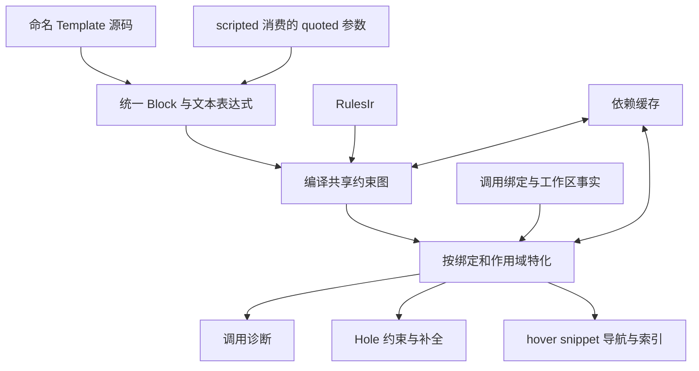

# Template 语义与分析重构方案

2026 年 10 月 2 日。状态为实施提案，尚未接入生产路径。

本方案统一 `scripted_effect`、`scripted_trigger` 及其消费的 quoted script，建立共享的 Template 分析核心。采用编译一次的约束图、按实参特化和增量缓存，使诊断、补全、hover、导航与索引使用同一份语义结果。

正确性以实际文本替换后的脚本语义为准。性能目标是消除重复推导和展开，常规编辑场景没有可测量的稳定退化；这一目标必须通过基准验收，目前的临时原型只验证了部分场景的工作量。

## 范围与语义边界

统一的概念叫 **Template**。命名的 scripted effect 和 scripted trigger 是具有入口 schema 的 Template；由它们消费的 quoted script 是 Template 的匿名脚本内容，入口 schema 和作用域由使用位置决定。两者共享有序 Block、参数表达式、激活条件和来源映射。

| 内容 | 入口规则 | 语义表示 |
| --- | --- | --- |
| `scripted_effect` 定义 | `effect` | 命名 Template，body 为 Block |
| `scripted_trigger` 定义 | `trigger` | 命名 Template，body 为 Block |
| Template 消费的 quoted script | 使用位置决定 | 解码后的匿名 Block，保留文本表达式与来源 |
| 普通带引号字符串 | 普通字段规则 | Scalar |
| mission 的 `trigger` 和 `effect` | 对应的普通块规则 | 只接受大括号 Block |

quoted script 只能在 scripted Template 的语义中使用。删除 mission 的 quoted 重载，并审计其他通用 quoted schema 入口。引号不能成为普通字段接受脚本块的理由。

IR 将被消费的 quoted script 理解为 Block，不再把它作为独立的字段形态。Block 的操作要区分“整个块作为 body”和“把块内 items 插入现有容器”，否则会改变字段数量、必需字段和控制链的含义。统一 IR 不增加游戏源语法；实参允许的写法仍由真实脚本语义决定。

保留以下语言约定：

- 参数替换先于运行时条件执行。普通 `if` 不会使其内部的文本参数自动变成可选。
- `[[PARAM] … ]` 和其否定形式属于参数存在条件；它们决定替换前哪些内容生效。
- 参数名和符号名沿用当前大小写不敏感的匹配方式；普通文本的大小写和转义保持不变。
- 转发处是否需要参数，由该处生效的文本替换决定。被调用 Template 内部存在可选分支，不能消除外层未受保护的参数引用。
- 参数没有值、正在编辑的 Hole、无法推导的值是不同状态。空字符串实参与参数缺失也要区分。
- 文本替换可以影响键、值、词缀和结构。结构化快路径的结果必须与文本语义一致。

本次重构覆盖参数发现、约束推导、作用域契约、必填推导、quoted 解析、诊断、补全、hover、snippet、导航、引用索引、overlay 和磁盘缓存。不改变其他游戏领域的脚本语义，不引入用户手写的第二套参数规则。

## 当前实现与调研证据

以下是 2026-10-02 调研快照，不是当前实现清单；后续代码重构可能已改变路径和职责。实施前重新核对相邻源码。

| 路径 | 当前职责与问题 |
| --- | --- |
| `crates/rules/src/replacement.rs` | 已有带源范围的 Template 树，保存 token 片段、参数引用、Block 和激活条件，可作为迁移起点 |
| `crates/ide/src/dynamic_rules.rs` | 推导参数使用行，保存作用域、条件和转发关系；部分路径仍有遍历预算和结构复制 |
| 当时的 `crates/ide/src/completion/dynamic_constraints.rs`（已退役） | 重放旧参数行；补全与 hover 对动态键子树使用不同策略 |
| `crates/hir/src/callable.rs` | 生产 IR 下根据实参重新遍历 Template；调用限制 32 层，条目预算 16,384，耗尽预算后停止遍历 |
| `crates/ide/src/ir_callable.rs` | 为重放出的使用位置提供校验与候选生成，尚未缓存特化结果 |
| `crates/ide/src/dynamic_contracts.rs` | 推导入口作用域；当前 IR 路径丢失激活条件后直接组合内部要求 |
| `crates/ide/src/ir_semantic.rs` | 逐参数取得使用位置并检查 quoted 内容，与必填推导存在独立路径 |
| `crates/ide/src/completion/ir.rs` | 使用首个参数使用位置生成标量候选，再过滤其他位置；quoted 补全还有独立递归入口 |
| `crates/hir/src/ir_lowering.rs` | 重放参数以收集引用和定义，属于必须同步迁移的消费者 |
| `crates/engine/src/host.rs` | 工作区与 overlay 更新中存在重新 lowering 和固定点处理；缓存依赖需要更精确 |

调研中复现了三个行为问题：激活条件内互不兼容的作用域要求被合并为空契约；转发参数的必填诊断与 hover、snippet 不一致；quoted payload 缺少右大括号时，内部 parser 有错误，但调用诊断漏报。

临时原型只支持固定键、标量约束、参数直接转发和固定 country 入口。得到的结果如下，计数是校验工作量，不是耗时：

| 输入 | 当前生产 HIR 重放 | 原型 |
| --- | --- | --- |
| 128 个定义组成的调用链，末端要求数字，传入 `no` | 触及深度限制，未获得末端约束 | 处理 128 个图节点，检出错误 |
| 13 个定义，每层调用下一层两次 | 产生 4096 个末端使用位置 | 处理 13 个图节点，执行一次相同的数值校验 |

该实验支持共享纯约束检查的方向。它尚未验证动态键、条件、不同作用域、Block 插入、来源投影和编辑缓存，也不能证明整条 IDE 路径更快。

## 总体架构

`RulesIr` 继续提供静态 schema、matcher、字段选择、作用域及控制流语义。Template 编译结果引用这些规则，不复制出一套动态参数 matcher。普通脚本检查与 Template 检查使用相同的字段选择和 Block 检查核心。



分析分为三个层次。语法层保存可恢复的源码结构和解码映射；编译层把与调用无关的工作完成，保留依赖实参的节点；查询层代入所需绑定和作用域，复用已有结果。IDE 消费者投影查询结果，不再各自遍历 Template 推导语义。

### 规则源接口

建议把 scripted 类型当前的 `Callable` 实现改为 `Template`，body schema 保持显式：

```json
{
  "traits": { "Template": {} },
  "types": {
    "scripted_effect": {
      "impl": { "Template": { "body": "effect" } }
    },
    "scripted_trigger": {
      "impl": { "Template": { "body": "trigger" } }
    }
  }
}
```

该接口声明类型具有文本替换语义及入口规则，不声明独立参数表。迁移 `Callable` 的识别、body 查询、规则文档与测试。规则表达式中已有的字面量模板 matcher 保留自身用途，文档中称为“字面量模式”，避免与 scripted Template 混淆。

目标是移除通用 `quoted<schema>` 表达式及 `Matcher::Quoted`、`FieldValue::Quoted`、`Shape::Quoted` 的脚本形态语义。普通字符串是否带引号仍由语法层保留。删除前必须完成全量入口审计和消费者迁移，不能只改枚举名称。

### 数据结构与来源

以下名称用于说明职责，Rust API 在实现阶段确定。

| 结构 | 内容 |
| --- | --- |
| `TemplateId` | 当前有效定义的稳定身份，与声明类型和覆盖选择关联 |
| `BlockId` | 有序 items 的共享身份，覆盖源码大括号和解码后的脚本内容 |
| `TextExprId` | 原始文字、参数引用、词缀拼接的共享表达式 |
| `BindingFrameId` | 当前参数绑定及转发关系，支持共享父环境 |
| `OriginId` | 源文件、范围、quoted 解码映射、替换来源和调用边 |
| `CompiledTemplate` | 约束图入口、参数读取索引、依赖、固定检查结果 |
| `TemplateAnalysis` | 生效约束、诊断证据、参数要求、结构与作用域结果、完成状态 |

调用绑定保留实参原始语法和文本。只在消费点需要脚本内容时建立解码的 Block 视图；需要普通值的位置使用 Scalar 视图，不能仅凭引号把实参永久定为脚本。

表达式和语义节点可共享，字段实例、出现次数、顺序和诊断来源不能因此消失。缓存保存相对来源身份，投影到当前调用时再映射实际范围；不能把某次调用的绝对范围放入可复用语义结果。

语法错误保留 Error 与 Hole 节点，继续编译能恢复的部分。当前“定义内任意语法错误就舍弃整个 Template”的行为需要移除，否则编辑未完成内容时补全会突然消失。

## 约束图与特化

编译结果是一份共享的检查程序。节点保留规则选择与参数之间的关系，避免把每个参数提前压成独立类型。

| 节点 | 含义 |
| --- | --- |
| `CheckValue` | 渲染表达式后，使用静态 matcher 检查值 |
| `All` | 不同生效使用位置必须全部成立 |
| `Any` | 同一使用位置的合法重载保留为备选 |
| `When` | 根据参数存在条件选择节点，保留条件表达式 |
| `RequireBinding` | 当前生效的替换位置必须有绑定 |
| `ScopeTransfer` | 按静态 IR 语义读写当前 scope、ROOT、PREV、FROM 等状态 |
| `Dispatch` | 根据渲染后的键、操作符和实际形态选择字段，保留依赖它的 value 或 body |
| `Call` | 引用被调用 Template，记录绑定表达式和作用域变换 |
| `Splice` | 在指定位置消费 Block 的 items |
| `CheckContainer` | 检查组合后的容器字段、控制链、数量和必需内容 |
| `Reparse` | 结构变化时，对受影响的文本容器重新解析 |

例如 `choose = { $COMMAND$ = $VALUE$ }` 编译为依赖 COMMAND 的 `Dispatch`。COMMAND 绑定后才能确定 VALUE 的规则；未绑定时保留关系，不能把 VALUE 简化为几个可能类型的并集。

字段选择复用普通 IR 的精确键优先、pattern 匹配、形态重载、作用域过滤和实际符号解析。一个重载的键、值、body 与作用域要求必须作为整体保留，不能分别求并集后组合出不存在的重载。

`When` 保留条件公式，不预先生成所有参数存在组合。普通运行时分支仍按现有静态脚本检查语义处理，但不会阻止其中的参数替换。显示性内容、引用收集和可执行语义的差异记录为节点元数据，由对应查询模式读取。

quoted Block 在多个生效位置使用时，各位置的要求都要满足；同一位置的重载是备选。没有绑定的动态键子树继续保留为延迟节点，不丢弃内部参数要求。

### Block 组合与局部解析

`Splice` 提供共享的容器视图，不复制完整子树。组合检查必须保留固定内容和插入内容的顺序、字段数量及控制链。必需字段由整个容器决定，不能在每个 fragment 上重复要求，也不能因为 fragment 根检查放宽而漏掉父容器要求。

可缓存字段计数和局部结构摘要，但发生跨 fragment 的顺序依赖时仍要检查容器边界。作用域不能仅依赖 Block 自身身份；同一 Block 在不同插入位置可能具有不同含义。

文本替换可能跨 token 改变词法或语法。阶段零先用明确的行为样例固定参数插入、转义、参数再替换及嵌套 quoted 的语义。编译器仅对已证明保持结构的替换走结构化快路径。

需要重新解析时，选择最小的、上下文足够的完整容器，保留边界文字与来源。不能假定单个 token 或单个 property 总能独立解析。若局部容器仍不足，向上扩大范围。文本以共享片段表达，按需流式读取；设置显式资源预算，避免先构造巨大的展开字符串。

### 求解与循环

求解器采用显式任务栈或工作队列。Template 调用、作用域转移和来源链处理不使用随调用深度增长的 Rust 递归。其他仍可能递归的解析、Block 遍历和文本表达式求值也纳入深度与取消审计。

静态调用图的强连通分量用于安排求解和缩小检查范围，不能仅凭定义之间存在回边就拒绝调用。固定有限抽象域中的单调约束可以做固定点求解；这不等于实际模板替换必然终止。

对实际调用，判环状态包含有效定义、展开所需绑定、参数存在状态和作用域。只有可证明等价的完整展开状态再次进入，才能报告展开循环；重新调用同一名字但关闭了激活分支的情况应正常结束。不能直接用某个参数查询的裁剪缓存键判环，抽象 scope 相同也不充分。不能使用“32 层以后接受”的语义。

对于绑定表达式持续增长、无法判定或资源耗尽的情况，分别记录分析覆盖状态和验证结论：

| 字段 | 状态 | 含义与消费行为 |
| --- | --- | --- |
| 覆盖状态 | `Complete` | 已完成所需查询；可能得到确定结论，也可能保留由 Hole 引起的未知约束 |
| 覆盖状态 | `Incomplete` | 深度、状态数、解析资源等预算不足；报告分析限制，保留已证明的诊断 |
| 覆盖状态 | `Cancelled` | 请求取消，及时停止，不发布部分结果为完整结果 |
| 验证结论 | `Valid` | 所有生效要求都已确定满足，仅允许与完整覆盖状态一起返回 |
| 验证结论 | `Invalid` | 有确定的拒绝证据；重载中尚未检查的分支可能接受时，不能提前判为拒绝 |
| 验证结论 | `Unknown` | Hole、缺少选择参数、规则事实不足或检查未完成；保留延迟约束 |

没有找到错误不能替代完整验证通过。为缺失选择参数保留的候选也不能标成已验证候选。缺失实参本身可由 `RequireBinding` 确定拒绝，同时保留依赖该实参的其他未知约束。

## 诊断与 IDE 消费

### 定义诊断与调用诊断

定义阶段检查已经确定的语法、固定键、常量值和局部结构，生成带条件的参数要求和作用域契约。依赖调用者的要求保留为约束，不把所有激活分支直接求交为唯一入口 scope。

调用阶段固定绑定和调用者 scope，只求解当前生效的检查。参数缺失、值错误、动态键错误及 Block 内部错误定位到调用实参，并提供定义使用位置作为关联信息。定义自身的固定错误在定义处报告；调用处按需要提供关联信息，避免每次复制完整诊断。

quoted 解码错误、外层引号未闭合、内部 parser 错误和普通 Block 语义错误都经过来源映射返回原文件。需要测试 UTF-8、转义、嵌套 quoted、非连续来源及编辑未完成状态。跨多个来源的错误选择明确主位置，其他范围作为关联位置，不能伪造一个连续范围。

同一使用点的所有合法重载都拒绝时才报告错误，保留完整约束证据；不同生效使用点各自检查。诊断去重依据源实例和约束身份，不能只按错误码与范围合并所有语义。

### 补全

补全把当前编辑位置建成 Hole，保持其他绑定和调用者状态，然后读取同一约束图。Hole 作为已存在的参数激活相应分支；缺失参数名候选则使用“加入该参数后”的假设状态。光标位置通过 quoted 解码与调用来源映射进入 Block 视图。

| 补全位置 | 候选生成与校验 |
| --- | --- |
| 参数名 | 查询参数读取索引及条件要求；排除当前已绑定项，生成一致的必填说明 |
| 普通值 | 从生效约束中选择可枚举的候选来源，再用完整关系过滤；不依赖使用位置顺序 |
| 带词缀参数 | 通过表达式逆向映射候选；不能简单去掉词缀后忽略其他表达式位置 |
| 动态键 | 为候选键特化其字段规则，检查已有 value 或 body；仅重算受该键影响的节点 |
| 动态键对应的值 | 使用已绑定键选择的规则；键缺失时保留候选成立的条件 |
| Block 内部 | 在实际容器与 scope 中补全；考虑固定兄弟内容、插入点和各生效使用位置 |

候选集合保持重载关系。`All` 下可选择一个覆盖所有合法结果的可枚举约束作为候选源，再过滤其他约束；`Any` 下各分支生成候选后求并集。数字或任意 Scalar 没有有限候选集合时，不阻止其他枚举或引用约束生成候选。

跨多个未知参数时不枚举笛卡尔积。能够确定合法的候选与依赖未填写参数的候选分开记录证据。前缀检索、排序和产品候选数量上限在语义候选生成后执行；验收工具必须能取得未截断集合。

snippet 的必填参数、hover 的约束解释和参数名补全使用同一个 `RequireBinding` 与 `When` 查询结果。定义侧 hover 展示条件要求，调用侧 hover 展示当前生效要求；它们是同一模型的不同投影。

### 导航与索引

参数引用、动态键解析、quoted 内部定义与引用都由共享核心生成语义事实。显示性声明等现有索引规则使用显式查询模式，不能为了索引重新建立一套字段与作用域解释。

来源图支持从调用实参、解码 Block 和定义使用位置互相定位。重复调用共享语义结果，但仍保留各个源调用边。参数绑定变化后，受影响的引用事实、定义事实和导航目标一起失效。

跨文件解析使用当前有效的 Template 定义身份。overlay、定义重命名、删除和覆盖优先级变化必须更新依赖，不能继续命中被遮蔽定义的结果。

## 缓存与性能设计

### 缓存层次

| 缓存 | 键与依赖 | 结果 |
| --- | --- | --- |
| 语法与解码 | 源内容身份、解析或解码版本 | 可恢复语法、错误、相对来源映射 |
| Template 编译 | 有效定义及 body 内容、编译格式版本、IR 指纹、实际读取的定义与符号事实 | 共享约束图、参数读取索引、固定检查 |
| 约束特化 | 节点、相关绑定投影、相关 scope、必要的 Block 身份及事实依赖 | 条件简化、规则选择和可复用约束 |
| 实参校验 | 特化约束、实际输入及其必要依赖 | 校验结果与相对来源证据 |
| 候选检索 | 特化的 Hole 约束、前缀、候选索引版本 | 候选与成立条件 |

节点记录自己的读取集。只读参数存在性的节点用存在状态作为上下文；动态键节点包含渲染所需值；读取 ROOT 的节点必须包含 ROOT。数值约束的特化可以忽略具体数值，但“该数值是否合法”的校验缓存必须包含值或经证明等价的摘要，避免错误命中。

相同语义输入在不同调用位置可以复用结果。被忽略的上下文必须经依赖分析证明无关；先采用保守依赖保证正确，再通过基准缩小上下文。延迟解析或动态选择尚未确定读取集时，保守保留可能相关的绑定，解析后再缩小依赖。转发 binding 和来源采用共享表达式，避免拷贝整条环境与调用链。

优先在现有 engine 查询缓存上添加 Template 查询和依赖版本，是否引入新的增量框架另行用数据判断。缓存失效至少覆盖规则指纹、有效定义选择、body 变化、引用符号集合、作用域事实和 overlay。修改参数值通常只失效当前调用的有关校验；修改定义只传播到真实依赖者。

编译图先以内存缓存落地，特化缓存设置容量和淘汰策略。持久化共享 Template 语法可继续使用索引缓存；是否持久化编译图在冷启动测量后决定。序列化 ID 不能脱离所属 IR 或源码版本使用。修改索引布局时升级缓存 schema；修改规则接口时同步源版本、JSON Schema、IR 指纹与 bake 元数据。调研时缓存 schema 为 23，实施时重新核对。

### 性能预期与边界

固定结构、相同相关上下文下，首次求解工作量与实际到达的图节点和边有关，重复调用复用纯约束结果。参数孔洞查询可通过读取索引裁剪到相关节点。约束特化缓存可以被诊断、补全与 hover 共同使用。

纯校验去重不消除结构的重复出现。字段数量、Block 顺序、不同 scope、不同绑定和来源投影可能继续产生必要工作。动态键的不同取值、结构变化后的解析、真实的大量不同上下文也存在额外成本，不能承诺所有输入的时间和空间都严格线性。

局部解析次数、求解状态数、缓存容量和来源投影都有可取消预算。预算用于控制编辑器资源，并在结果中标记完成状态；不能通过静默截断获得更好的性能数据。

## 验证与验收

### 语义参照

建立仅用于测试的小型文本展开器，以明确的替换语义展开规模受限、可终止的样例，再交给普通 parser 与 `RulesIr` 检查。展开器采用显式栈、资源上限和来源映射，不进入生产查询路径。

该参照用于验证 Template 图的替换与组合语义。普通静态 IR 检查本身还需要直接样例作为独立断言。旧动态规则输出可帮助定位差异，但已知错误行为不能成为验收标准。

比较规范化的诊断身份、主范围、关联来源、完整候选集合、作用域和引用事实。两边预算耗尽或候选截断的样例单独报告，不能算作等价。

### 必须覆盖的场景

| 场景 | 必须成立的结果 |
| --- | --- |
| mission 的 quoted `trigger` 与 `effect` | 拒绝，普通大括号版本保持有效 |
| 普通字符串与脚本参数 | 只在 scripted 消费位置解析脚本，普通字符串保持 Scalar |
| 正反激活条件与嵌套条件 | 非生效分支不参与要求；生效分支一致决定诊断、hover 与 snippet |
| 普通运行时条件和转发 | 参数替换要求不因运行时条件或被调用者可选分支而丢失 |
| 动态键和值、body、scope 的关联 | 使用真实选择结果，禁止产生不存在的重载组合 |
| 词缀、重复孔洞、多参数表达式 | 渲染、反向候选和诊断与文本参照一致 |
| Block 多位置消费与容器组合 | 保留各位置要求、字段次数、顺序、必需字段和控制链 |
| quoted 与结构变化 | 缺失括号、转义、UTF-8、嵌套、局部重解析均正确定位 |
| ROOT、PREV、FROM 与作用域链接 | 不同调用上下文分别检查，缓存不混用 |
| 10,000 个定义的调用链 | 完成约束检查，Template 求解过程不发生原生栈溢出 |
| 逐层重复转发形成的共享图 | 相同上下文的纯校验共享，结构计数仍正确 |
| 潜在回边、有限再调用、无限调用 | 区分关闭分支后的终止和实际循环，资源不足有明确状态 |
| 编辑中的 Hole 与语法错误 | 可恢复内容继续提供补全，不丢弃整份定义 |
| overlay、覆盖、删除与重命名 | 结果不含旧绑定、旧目标或旧来源；磁盘缓存与新构建一致 |
| 取消和预算 | 及时返回，不把部分结果当作完整验证通过 |

### 性能验收

冻结比较版本、规则指纹、工作区内容、构建模式、缓存状态和机器环境。使用至少五组顺序配对运行判断噪声；交互查询在固定编辑轨迹中采集足够样本，报告样本数以及 p50、p95。冷热数据分开，不把调试构建与 release 对比。

| 指标 | 测量内容 |
| --- | --- |
| 冷启动与建索引 | Template 编译、完整工作区初始化、磁盘缓存首次建立与加载 |
| 诊断 | 首次调用、重复调用、修改单个实参、修改被依赖定义后的延迟 |
| 补全 | 参数名、普通值、动态键、Block 内容；完整集合与产品截断集合分别记录 |
| 内存 | 峰值 RSS、稳定 RSS、图大小、特化缓存大小及淘汰后状态 |
| 工作量 | 求解状态、节点检查、重复复用、局部解析、失效查询数量 |
| 编辑与取消 | overlay 更新成本、持续输入时的取消响应和结果发布 |

常规场景目标为没有超出重复基线噪声范围的稳定退化。任何稳定退化都阻塞默认切换，查明来源并优化后重新测量；不预先把某个固定下降百分比定义为“性能无损”。

原路径因截断而漏检的长链不适合直接用耗时判定新路径退化，应单独报告新增正确检查的成本，并验证其状态数随独立图节点增长。完整 Vanilla 对照、相关 LSP 查询和完整内存探针都要执行，不能仅凭单元测试或局部原型判断验收完成。

## 实施阶段

每个阶段保留明确的出口条件。生产切换前允许内部开发开关并行比较，完成迁移后删除旧路径，不长期维护两份动态语义。

| 阶段 | 工作 | 出口条件 |
| --- | --- | --- |
| 零 语义与基线 | 固定文本替换、激活、转义和 quoted 消费语义；建立展开参照及性能基线 | 关键语义样例有独立断言，比较数据可复现 |
| 一 统一表示 | 引入 Template 接口、Block 与来源图；保留 Hole；修正 mission quoted 规则并审计入口 | 源语言检查通过，quoted 边界与源位置测试通过 |
| 二 分析核心 | 编译约束图，完成字段与 scope 检查、条件、转发、Block 组合、循环、局部解析和状态返回 | 与文本参照对照通过，长链与共享图符合工作量预期 |
| 三 IDE 消费 | 迁移诊断、补全、hover、snippet、导航、引用索引及显示性事实 | 相关功能读取同一模型，生产 IR 夹具与完整候选对照通过 |
| 四 增量与缓存 | 接入定义和事实依赖、相关上下文缓存、overlay、持久化版本及取消预算 | 冷热查询、编辑失效、缓存往返和完整内存验收通过 |
| 五 切换与清理 | 完整 Vanilla 和 LSP 对照，移除旧动态行推导、重放及通用 quoted 路径，更新文档 | 所有差异有语义依据，无性能验收阻塞，默认路径唯一 |

相关模块的建议归属：`rules` 保存静态规则、Template 标记及必要的共享表达式类型；`parser` 负责恢复解析、quoted 解码和编码；`hir` 承担 Template 编译与共享分析；`engine` 负责查询依赖、缓存与有效定义选择；`ide` 负责诊断与补全等用户结果的投影。核心不依赖 LSP 或 UI 类型。Template 导致的 workspace 全量重新 lowering 和固定点循环，要改为依赖驱动更新；其他模块独立需要的固定点机制按自身职责保留。

阶段五清理涉及 `dynamic_rules`、`dynamic_constraints`、`dynamic_contracts`、`dynamic_cycles`、`hir::callable`、`ir_callable` 以及各消费者中的专用遍历。按功能确认替代关系后删除；静态字面量 matcher、普通 Block 和源范围工具保留其独立职责。

文档更新包括规则语言、诊断说明、术语表、规则重构设计与验收记录。当前规则系统阶段五本身尚有独立验收工作；Template 的局部测试通过不能替代整个规则系统的验收。

## 设计依据

以下资料支持方法选择，不能直接证明本项目的正确性或性能。约束节点、quoted 边界和迁移步骤是本方案针对当前仓库提出的设计。

- [Partial Evaluation and Automatic Program Generation](https://raspi.itu.dk/people/sestoft/pebook/pebook.html) 说明如何利用已知输入完成部分计算，保留未知输入对应的剩余程序。这里对应固定规则预编译与依赖绑定的延迟节点。
- [Hybrid Inlining](https://arxiv.org/abs/2210.14436) 共享可摘要部分，并对依赖上下文的关键部分继续分析。这里借鉴其共享与延迟特化的划分，不采用论文的性能数字作为目标证据。
- [Static Program Analysis 的跨过程分析资料](https://cs.au.dk/~amoeller/spa/7-interprocedural-analysis.pdf) 介绍按输入抽象状态复用摘要，以及选择相关状态控制上下文数量的方法。这里对应读取集与相关上下文缓存。
- [rust-analyzer 架构](https://rust-analyzer.github.io/book/contributing/architecture.html) 介绍按需增量计算和保留错误的语法结构。这里对应共享语义查询、局部失效及编辑未完成状态的恢复。

最终是否达到正确性和性能目标，以本方案列出的语义对照、生产功能回归、Vanilla 与性能报告为准。
