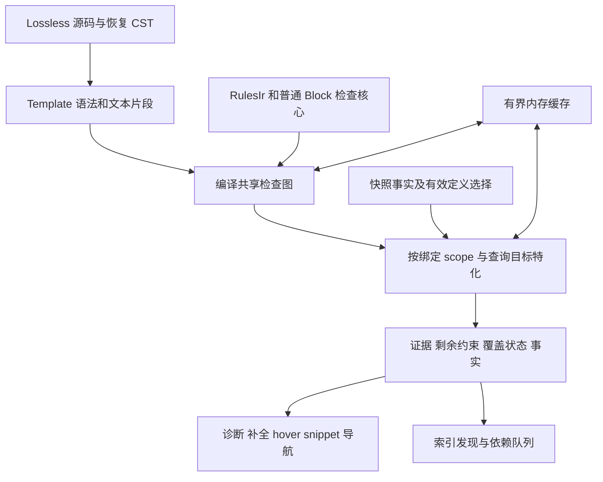

# Template 语义与分析重设计方案

2026 年 10 月 3 日修订。状态：实施提案；共享分析核心尚未接入生产。

复核基线为 `cbd6c6a`，并计入 `c25f4f8` 的 scripted 参数诊断与补全修复。本文替代原提案，实际接口名在实施 PR 中确定。源码事实、设计决定和需要游戏实验确认的行为分别列明；本文不把分析器的现有行为当作 EU4 引擎规范。

## 评审结论与修订理由

认同原方案的主方向：保留带来源的文本替换表示，把与调用无关的工作编译为共享检查图，再按绑定和作用域特化；诊断、补全、hover、snippet 与索引共同读取该模型。认同保留动态键依赖、区分同一位置的重载与不同位置的约束、完整检查拼接容器，以及显式返回分析完成状态。

原方案还不能直接作为实施契约。以下修订解决事实漂移和关键设计缺口：

| 核对项或需要补足的契约 | 修订与理由 |
| --- | --- |
| `dynamic_rules` 推导旧式参数使用行，清理列表包含 `dynamic_constraints` | 当前 `dynamic_rules` 主要推导参数存在要求；`dynamic_constraints` 已移除。替换清单按实际消费者列出 |
| 历史 quoted 漏报与首位置补全问题需要在小修后更新 | 本次小修已覆盖这些行为；保留回归，不重复列为待实施功能 |
| 修改索引时升级独立 schema，快照 schema 为 23 | 项目已统一以 LSP release version 判定持久化兼容性；按现有发布与缓存约定迁移 |
| 原型工作量已注明局限，但缺少本修订中的复跑证据 | 只保留为历史方向性证据；新实现需要同语义、同完成状态的实测 |
| 现有 engine 缓存的能力边界未展开 | 当前是按域失效的有界结果缓存，不具备每条读取依赖的自动追踪或跨请求求解去重；必须实现所需机制 |
| 原稿要求保留次数与来源，尚未定义实例与输出预算 | 分开语义计算、容器出现次数和来源实例，补充数量摘要、实例路径与投影预算 |
| 引用的定义变化会使缓存失效 | 还要记录查找失败、候选集合、覆盖优先级、源根和查询模式；新增定义也能改变旧结果 |
| 覆盖状态的查询边界和 Unknown 组合规则不够具体 | 增加逐查询覆盖范围、三值组合规则、限制原因及消费者的发布契约 |
| 原稿已拒绝直接按 SCC 判环，但摘要固定点的抽象域尚未定义 | 区分潜在调用回边、实际替换状态重复和摘要求解循环；明确单调条件与非单调重建 |
| 复用当前 scope 逻辑时，运行时 `OR` 的合并策略未单独审计 | `Any` 只表达一个源位置的合法解释；运行时 `OR` 内的各个语句仍接受静态合法性检查 |
| 跨 token 替换缺少 lossless 表示契约 | 当前 token 树缺少完整 trivia、错误节点与文本边界；语义参照与慢路径必须保留 lossless 源片段 |
| trait 改名被安排为统一表示的前置工作 | 先固定语义与完成状态，再接共享核心；规则源改名与持久化作为可独立审阅的迁移 |
| mission quoted 目标、现有大小写约定与引擎证据未充分区分 | 分开记录项目目标、现有实现和引擎证据；不使用其他 Paradox 游戏文档代替 EU4 验证 |

## 当前实现事实

以下入口在修订时按源码核对。后续实施重新检查相邻代码，不依赖固定行号。

| 入口 | 当前职责与仍需替换的行为 |
| --- | --- |
| [rules/replacement.rs](../rules/src/replacement.rs) | 定义共享的源范围 token、参数片段、property、Block 和参数存在条件树 |
| [hir/templates.rs](src/templates.rs) | 从 CST 构造 Template；定义范围内存在 parser 错误时跳过整份定义，遇到不能表示的节点也放弃 |
| [hir/callable.rs](src/callable.rs) | 按绑定遍历使用位置与缺失实参；有调用深度、遍历预算和仅按名字的访问保护；限制没有形成可供所有消费者检查的完成状态 |
| [ide/ir_callable.rs](../ide/src/ir_callable.rs) | 把使用位置解释为 matcher、动态键和 payload 域；未解析域可被保守接受，不等于完成验证 |
| [ide/ir_semantic.rs](../ide/src/ir_semantic.rs) | 进行普通 IR 和调用实参诊断；本次修复将 quoted payload parser 错误映射到实参，按 payload 报一次 |
| [ide/completion/ir.rs](../ide/src/completion/ir.rs) | 本次修复汇集各使用位置可枚举的候选、去重后按全部现有约束过滤；quoted 内容仍有专用递归查询 |
| [ide/dynamic_rules.rs](../ide/src/dynamic_rules.rs) | 供 hover、snippet 等使用的参数必填推导；转发被视为 activation-scoped，仍与调用诊断的文本替换要求分离 |
| [ide/dynamic_contracts.rs](../ide/src/dynamic_contracts.rs) | 缓存定义侧入口 scope；参数存在条件没有保留为条件契约，运行时 `OR` 还有单独的合并策略 |
| [ide/dynamic_cycles.rs](../ide/src/dynamic_cycles.rs) | 从静态名字及部分调用绑定建立 SCC，并报告定义周期；这不能证明每个具体绑定都不终止 |
| [hir/ir_lowering.rs](src/ir_lowering.rs) | 使用 Callable replay 收集 payload 中的定义与引用；包含必须保留的显示性声明语义 |
| [engine/host.rs](../engine/src/host.rs) | 更新受符号事实影响的打开文档；全量索引通过反复 replay 稳定符号集合，并有固定轮次上限 |
| [engine/query_cache.rs](../engine/src/query_cache.rs) | 分 Index、Documents、Frontends、Definitions 域管理有界缓存；超限按域清空，不是依赖图或字节预算 |
| [engine/index_cache](../engine/src/index_cache/mod.rs)、[vfs/parse_cache](../vfs/src/parse_cache.rs) | 以 LSP release version 检查持久化兼容性；规则指纹仍可用于审计与内存语义身份 |

当前 first-party 规则的 `quoted<…>` 使用点在 [missions.json](../../rules/eu4/missions.json) 的 mission `trigger` 与 `effect` 重载中。它们现在确实被分析器接受，不能把目标中的删除写成已完成的现状。静态规则仍通过 [Callable trait](../../rules/eu4/core/traits.json) 与类型的 `body` 参数标记 scripted 类型。

本次 owned fixture 已固定两项修复：quoted payload 的缺括号、缺值及转义/UTF-8 源映射；任意 Scalar 使用位置先于 bool 位置时，合法 bool 补全仍能出现，重复使用不重复候选、不兼容使用继续过滤。40 层参数转发仍能越过当前分析深度而漏掉末端数字拒绝，属于新核心需要解决的问题。

旧方案记载的 128 层链与二叉转发原型是 2026-10-02 的历史实验，未在本修订中复跑。它们不能用作当前完成率、时间复杂度或性能验收数字。

## 语义边界与阶段零证据

Template 是带文本参数的脚本表示，具备命名定义或匿名内容来源。命名 `scripted_effect` 与 `scripted_trigger` 的入口 schema 继续由规则声明。调用实参先保存原始语法和文本，只有消费点需要脚本时才建立 Block 视图。

| 内容 | 目标解释 |
| --- | --- |
| 命名 scripted effect/trigger | Template，分别以 effect/trigger schema 检查 |
| 参数在脚本内容位置被消费 | 解码文本的匿名 Block；区分整个 body 与插入父容器的 items |
| 参数在普通 scalar 位置被消费 | Scalar 文本视图，即使有引号或包含 `{` 也不能自行升级为脚本 |
| 同一参数同时用于 Scalar 和脚本位置 | 保留同一输入的不同视图，各个生效位置独立检查 |
| mission 的普通 `trigger`/`effect` | 目标只接受大括号 Block；删除直接 quoted 重载是项目支持范围的行为改变 |
| 编辑未完成的输入 | 保留 Error、Hole 与未知结构边界，返回剩余约束和查询覆盖状态 |

上述 quoted 范围沿用原提案的项目目标。任务不包含实施这项规则变更；正式切换时需要 owned 回归、完整 Vanilla 差异解释及变更说明。不能依据其他游戏的宏规则推断 EU4 的引号或递归行为。

阶段零必须建立替换行为矩阵。每条记录包含最小输入、目标游戏版本、证据来源、观察结果、采用的项目语义及未决项。可公开的 owned 样例与结论进入测试；游戏原文件、运行日志和安装路径留在本机。

| 需要固定的行为 | 初始设计约束与验证要求 |
| --- | --- |
| 参数存在与空串 | 区分 Missing、Present Empty、Present Text、Present Hole；不能用空字符串判断缺失 |
| `[[P] … ]` 与否定条件 | 保存存在条件公式；是否激活取决于存在状态，未知状态保留分支要求 |
| 普通运行时 `if`/`OR` | 不消除文本参数要求；检查所有静态生效的语句，不执行游戏运行时控制流 |
| 外层未保护的转发 `inner = { X = $P$ }` | 目标按外层实际替换要求推导 P，不能因 inner 的可选分支自动省略；用 EU4 实验固定替换次序 |
| 引号、反斜线、嵌套 quoted 与换行 | 保存原始拼写并逐层解码；不能在所有 token 上套用 quoted-script 解码 |
| 重复实参 | 保持当前最后一个有效 scalar 绑定取胜及重复提示；以实验核对块实参、混合形态和大小写冲突 |
| 参数和符号大小写 | 当前分析器采用大小写不敏感查找；这是现有项目约定，不能据此声称引擎在所有上下文同样处理 |
| 新值中出现 `$P$`、参数连接和跨 token 替换 | 固定是否再次扫描、在哪个词法层扫描以及终止规则；来源范围不能代替文本替换语义 |
| 同名有限再调用与无限调用 | 区分参数条件关闭后的终止、持续文本增长、真正重复替换状态，以及运行时递归；没有引擎证据时不宣称 SCC 代表引擎必然失败 |

前六项的常规路径可以按当前约定先实施；影响替换次序、结构或判环的未决样例必须在进入默认路径前有明确决定。无法证明等价的结构走保守重解析或 Unknown，不能悄悄按已有 token 树猜测。

## 共享核心与职责



`rules` 拥有静态 schema、matcher、选择规则与能力声明；`parser` 拥有 lossless 恢复语法、quoted 编解码和相对位置映射；`hir` 拥有 Template 表示、编译及编辑器无关的共享检查；`engine` 拥有快照、有效定义选择、依赖版本、工作队列和缓存；`ide` 把证据投影为用户结果；`pdc` 保持协议转换、取消与过期结果拒绝。

当前普通语义检查的一部分位于 `ide::ir_semantic`。先抽出协议无关的字段选择、matcher、scope 与 Block 检查接口，使普通脚本和 Template 使用相同实现。HIR 核心返回 `ConstraintEvidence` 和语义事实，不能依赖 `ide::Diagnostic`、LSP 类型或 UI 文案；索引也不能因此反向依赖 IDE。可以分步抽取接口，但不能长期复制一份 matcher 或容器规则。

第一阶段保持规则源 `Callable { body: … }` 接口，把它适配成内部 Template 能力。`Callable` 改名并不能建立新语义，没有必要作为分析核心的前置条件。若最终采用 `Template` trait，单独迁移识别入口、bundle/compiler、generated source reference 和测试。`Matcher::Template` 的字面量模式保持自身含义。

删除通用 `quoted<schema>`、`Matcher::Quoted`、`FieldValue::Quoted` 与 `Shape::Quoted` 的脚本形态前，先完成 first-party 使用点、compiler 接口、规则文档、测试、索引 codec 和全部消费者审计。字符串的 quoted 标记、编解码与源映射仍保留。

### 表示与身份

| 概念 | 必须携带的信息 |
| --- | --- |
| 有效定义选择 | `(kind, folded name)` 的解析结果、声明身份、内容修订及源根/覆盖选择版本；查找失败也有依赖 |
| Template 语法 | lossless 源片段、Property/有序 Block、存在条件、operator、参数引用、Error/Hole 与未知边界 |
| 文本表达式 | 原始文字、参数引用、拼接表达式及确定的解码/替换层；表达式和来源分别 intern |
| 绑定帧 | 参数存在状态、原始实参、转发表达式、共享父环境；Hole 有稳定编辑身份 |
| 图节点 | 静态规则句柄、子节点、参数/事实读取摘要、未知依赖边界 |
| 实例路径 | 容器内顺序、每次调用或 splice 的出现身份；共享语义不能抹掉它 |
| 来源图 | 定义、实参、解码映射和调用边的相对关联；允许一个语义范围对应多个源片段 |

语义内容共享和来源位置共享分开处理。同样的 body 可以复用编译图，但空白移动后的源映射必须来自新语法身份；两个不同定义的相同 body 不能混用名称、覆盖选择或来源。arena ID 只在所属 IR/语法/快照身份内有效，跨缓存往返必须重建或验证所属身份。

语法层不能只保存当前 Template token 树：它忽略 comment/trivia 并不能表示错误结构。保留 CST 或 source-piece rope 作为文本语义依据，现有 token 树只作为可以证明结构稳定的编译输入。未知片段仍记录可以发现的参数及相对来源，不把任意语法错误变成整份定义不存在。

定义侧区分 Template 元语法错误与替换后脚本错误。未闭合的参数标记或不能恢复的存在条件边界属于源语法问题；依赖未知文本插入才能决定的普通脚本结构保留为 Recover/Reparse，不能提前当作确定 Invalid。固定检查也保存所在 `When` 的条件，定义摘要可解释潜在问题，调用诊断只投影实际生效且已经证明的拒绝。

## 编译、特化与验证

共享图是检查程序，不是按参数拆成互不相关的类型表。保留有序容器与表达式依赖，只预计算不依赖绑定的部分。

| 节点 | 契约 |
| --- | --- |
| `CheckValue` | 渲染表达式后检查 matcher，保留来源证据 |
| `All` | 不同生效源位置的要求全部成立 |
| `Any` | 同一源位置的合法规则解释至少一个成立；一个分支的 key、shape、operator、scope、value/body 和后续状态保持关联 |
| `When` | 根据参数存在状态选择要求；未知时保留条件，不枚举全部存在组合 |
| `RequireBinding` | 当前生效的文本读取必须有绑定，guard 自身的存在测试不直接要求绑定 |
| `Dispatch` | 根据渲染的键、实际形态、operator 与事实选择规则；动态键未定时保留 value/body 的关联要求 |
| `ScopeTransfer` | 复用普通 IR 的 scope、ROOT、PREV、FROM 和链接转换；相同 scope 的含义不能只凭集合相等断言等价 |
| `Call` | 引用有效 Template 选择、转发表达式和调用模式，不复制整个 callee 图 |
| `Splice` | 以共享视图把 items 插入特定父容器和位置 |
| `CheckContainer` | 在组合后的整份容器上检查数量、必需字段、顺序及控制链 |
| `Reparse` | 结构无法证明稳定时，按资源预算重新解析足够完整的文本容器 |
| `Recover` | 保留 Error/Hole、可能读取和未知边界，使可恢复的其他部分继续可查询 |

`$COMMAND$ = $VALUE$` 中 VALUE 的规则依赖 COMMAND；不能先把各个可能值规则求并集，再与一个无关的 key 集合相乘。若多个合法解释产生不同后续 scope 或定义事实，保持分支结果直到能够证明安全合并；不能把单个字段的重载选择同整个容器的选择分离。

在普通 matcher 的 union 内可以共享纯值校验。字段形态重载仍以整个解释为单位；`Any` 并不意味着可以丢掉 operator、scope 或 body 约束。运行时 `OR` 的真值是游戏逻辑，不提供把错误语句视为有效脚本的备选解释。

### 查询边界

所有消费者以明确查询目标访问同一核心，而不是被迫实例化整份调用：

| 查询 | 必须覆盖的内容 |
| --- | --- |
| 定义摘要 | 参数读取、存在条件、固定问题、潜在调用及残余 scope 要求；不要求穷举全部实参 |
| 调用验证 | 实际绑定和 scope 下全部生效的值与容器要求 |
| 参数名或 Hole 查询 | 影响指定编辑位置的节点、存在假设及候选成立条件 |
| 显示摘要 | hover/snippet 所需的条件说明与必填要求 |
| 执行语义事实 | 实际生效的解析、引用及定义事实 |
| 索引发现 | 项目约定的显示性声明、未知分支潜在读取及调用边；与执行查询有不同筛选条件 |

编译图不依赖查询目标，特化和结果缓存必须包含目标/模式。预览块内用于导航的声明可以在索引发现中保留，而不把它们当作可执行要求。核心记录这些差异，消费者不能靠重新遍历 Template 恢复第二套语义。

公开契约至少包含：结果值、逐目标覆盖、验证结论、限制原因、残余约束、证据及依赖。取消通过错误/控制返回退出，不缓存或发布为完成结果。输出可以流式访问共享摘要和来源实例，不要求先分配完整展开后的所有位置。

### 覆盖状态与三值结论

覆盖状态相对于某个查询目标定义。完成一个参数的候选查询，不等于完成整份调用；完成定义编译，不等于所有 future binding 都可验证。

| 状态 | 消费契约 |
| --- | --- |
| `Complete` | 已覆盖该查询要求的节点；Hole 或不可确定事实仍可能产生 Unknown |
| `Incomplete(reason, frontier)` | 深度/状态/解析/候选/来源等资源不足；保存未完成边界与已证明的证据，不能标为全部通过 |
| `Cancelled` | 及时退出；LSP 取消或旧版本结果由协议层丢弃 |
| `Valid` | 全部生效要求已经确定满足，且对应验证查询必须 Complete |
| `Invalid` | 有独立的确定拒绝证据；其他位置未检查不抹掉该证据 |
| `Unknown` | 信息或覆盖不足，没有确定通过或拒绝；不会因未找到错误变成 Valid |

节点结论组合必须有直接测试：

| 组合 | 结果 |
| --- | --- |
| `All(Invalid, Unknown)` | Invalid，保留确定拒绝；整体覆盖仍可能 Incomplete |
| `All(Valid, Unknown)` | Unknown |
| `Any(Valid, Unknown)` | 该位置 Valid；仍需满足调用其他位置和其覆盖要求 |
| `Any(Invalid, Unknown)` | Unknown，不能仅凭已拒绝的分支报告此位置错误 |
| `Any` 的全部合法分支 Invalid | 此位置 Invalid，选择明确证据解释各分支的失败 |
| `When` 的条件未知 | 保留 guarded 结果；只有与条件无关或所有可行分支都拒绝的证据能变成确定错误 |

分析限制不伪装成脚本语法错误。实现明确的分析限制状态，并为诊断消费者定义可定位的 warning/information（若增加 diagnostic code，同步注册表及指南）；批量审计与验证工具记录覆盖不足，不能报告完整通过。补全可以呈现由未知参数决定的候选，但结果携带成立条件和覆盖标记；已验证候选与推测候选不能混用。部分导航事实可以保留，重命名在相关引用集合不完整时拒绝生成不完整编辑。

定义处的 EmptyScopeContract 只在可证明没有任何可行的绑定/激活状态能满足契约时成立。无法穷举证明时保留条件摘要，调用处按实际绑定检查；不能把所有存在分支的 scope 直接求交后宣称定义永远不可用。

## Block 组合、重解析与来源

共享容器视图保留父容器、位置和每次出现身份。把一个 Block 用两次仍有两份字段出现，`if`/`else` 链也可能跨 fragment 边界。固定 fragment 与插入 fragment 的数量合计后再检查 cardinality；必需 `limit` 等要求从完整父容器判断，不能对每个 fragment 重复要求，也不能全局放宽后漏掉嵌套完整 Block 的要求。

数量摘要允许压缩，但不能溢出。只问是否超过有限上限时，可用饱和于 `upper + 1` 的计数并保存首个越界实例；需要完整事实集合时采用受预算控制的实例流。控制链检查保存边界摘要和顺序；不能用无序集合去重结构出现。纯值校验可按共享语义键只执行一次，诊断按语义证据与源实例投影，超过来源预算则标记 Incomplete，不能产生指数级来源数组。

结构化快路径仅用于阶段零证明保持词法/结构边界的替换。raw value、quoted value 的文本层次不同；参数中的引号、注释、`=`、大括号或换行可能改变周围 token，不能只重解析参数自身。先从最小的完整可判定容器重解析；不足时扩大到父容器或整个 body。不得把尚未生效的参数存在条件文字直接送入普通 parser 当作已经展开的脚本。

重解析使用共享片段、长度预估及渐进预算；在构造大字符串或进入 parser 前检查单个容器和全查询字节限制。Template 遍历、来源投影、计数、文本表达式求值及 parser 调用都在资源审计中，不能只给求解工作队列设上限。

来源组合按有向图保存相对片段关系：定义 token → 参数绑定 → quoted 解码 → 插入点 → 调用源实例。诊断选择可解释的主位置，把其他定义或实参位置作为 related evidence；跨多个源片段不能伪造连续范围。错误恢复时可退回完整实参范围并说明定位精度，不能发布一个属于解码文本的偏移到原文件。

普通 quoted payload 的 parser 错误按 payload 实例报告一次，独立于 schema 重载数量；语义错误则保留其解释分支证据。修复文本逆向经过全部相关 quoted 编码层，并映射主范围、quick fix 和相关来源；来源不能唯一逆投影时不生成有损 quick fix。UTF-8 byte range 与 LSP UTF-16 position 的转换仍由协议边界负责。

## 调用图、循环与事实稳定

求解使用显式任务栈/工作队列。长链不消耗随 Template 调用深度增长的 Rust 栈。当前 cycle 模块的 Tarjan 已是迭代实现，重设计应复用或替换其职责，不能把它描述成需要修复的递归 Tarjan。

静态调用图包括确定边和带条件的潜在边，SCC 用于排序和局部调度，不能直接从潜在 SCC 得到每个调用都无限展开。区分三种现象：

1. 同一个节点被不同查询或源实例访问：正常共享。
2. 摘要约束沿调用回边传播：在声明的有限抽象域中用工作队列求固定点；必须说明偏序、join 和收敛上限，scope/后续状态不能随意求并集。
3. 实际替换无法终止：仅在采用的替换语义和充分具体的状态下证明；名字重复、缓存命中或抽象 scope 相同均不够。

实际展开状态包含有效定义身份、展开所需的完整绑定表达式/存在状态、文本解释层及影响展开的上下文。来源链不属于语义判环键，避免同一状态仅因链更长而永不相等；来源另外保存。检查摘要的键可以裁剪无关参数，但不能自动拿它作为实际展开判环键。

绑定持续增长但没有相同状态时，返回限制原因与 Unknown，不误报已经证明的周期。runtime recursion、参数替换 recursion 的边界必须按阶段零证据区分；只在证明适用的范围里报告 DynamicDefinitionCycle。条件关闭后有限再调用的 owned fixture 必须通过。

payload 可以声明新的符号，改变其他 Template 的选择或引用，因而索引稳定问题独立于 Template 调用终止。engine 采用以下事务流程：

1. 普通语法索引建立基础声明与覆盖选择。
2. 相关 Template 查询记录已读事实、未命中查找及生成事实。
3. 事实差异驱动依赖工作队列；受影响 SCC 重新求解，未受影响文件不重新 lowering。
4. 在指定发现查询完整且稳定后原子提交事实、依赖及来源；取消和未收敛不能安装成完整索引。

删除、覆盖变化或实参修改会撤销旧事实，不能只做 append-only join。受影响组件从基础声明和仍有效输入重新计算；非单调规则选择需要明确重建边界，不能借用单调固定点的收敛结论。保留旧已提交快照可供编辑器过渡，但新的失败/过期状态必须可观察，重命名和验收不能读取它作为当前完整结果。

## 补全、说明与导航

补全把指定位置表示为 Present Hole，并按实际存在条件和其他绑定特化。参数名候选使用“加入该参数”的假设状态；不能把当前缺失视图的结果直接当作加入后的契约。

候选生成与验证分开。`Any` 的各合法解释生成来源后求并集，`All` 用同一绑定在所有生效位置校验。任意 Scalar 或数字没有有限枚举，不得阻止其他位置贡献候选。首个非空候选源也不天然覆盖合法值；只有证明某来源提供完整超集时，才可以跳过其他来源。词缀逆映射需要同时满足同一表达式的其他孔洞及其他使用位置，不能仅去掉 prefix/suffix 就宣称已经验证。

前缀直接传给索引检索以避免枚举整个工作区，结果仍通过完整约束过滤。排序、去重和产品数量截断保持独立；增加产品候选限额不能代替语义覆盖状态。审计提供无产品截断的集合模式，但该模式仍有显式资源预算；超预算的集合标为不完整，不拿它与完整集合宣称等价。

对于动态键候选，同时特化其 value/body/scope 分支。已经存在的不合法值不能因键本身合法就产生“已验证”候选。多个未知参数不枚举笛卡尔积，保留条件候选与关系约束。quoted 内容补全在实际父容器与插入位置进行，不能忽略固定兄弟字段、上限或跨边界控制链。

hover、snippet 和必填参数说明读取相同 `RequireBinding`/`When` 模型。定义侧显示条件要求，调用侧显示实际生效要求；未知 scope、条件和预算在说明中保留。索引、导航及引用读取共享事实与来源模式，覆盖/重命名/删除后不会命中旧目标。重命名还需要当前版本的相关事实集合完整，而不是仅有一个可跳转目标。

## 增量依赖、缓存与资源

优先扩展现有 engine 缓存和查询入口，不预设引入新的增量框架。先用粗依赖保证正确，再用统计证明精化收益。当前缓存的域版本是安全起点，但不能声称“只更新真实依赖者”已经实现。

| 缓存层 | 语义键与依赖 | 内容 |
| --- | --- | --- |
| 语法/解码 | 原始内容、解析/解码规则与文本层身份 | 恢复 CST、错误、相对来源映射 |
| 编译图 | Template 语法内容、入口 schema、所属 IR 身份；编译实际读取的规则/事实依赖 | 共享节点、读取摘要、固定检查与未知边界 |
| 特化摘要 | 图节点、相关绑定/存在状态、相关 scope、Block 结构身份、查询模式与事实依赖 | guarded 约束、规则解释、后续状态与摘要 |
| 值验证 | 特化约束、真实输入或经证明等价的值摘要 | Valid/Invalid/Unknown 与相对证据 |
| 候选检索 | Hole 约束、前缀、候选命名空间版本、查询模式 | 候选、条件及集合覆盖状态 |
| 来源投影 | 语义证据、当前语法/实参来源身份及实例路径 | 当前文件范围和关联来源；不能仅以语义内容为键 |

依赖至少包括：有效定义解析及未命中解析、可用重载/候选集合、body 内容、参数存在与值读取、scope 寄存器、动态符号集合、源根/覆盖/overlay 屏蔽规则和查询模式。`not found` 不是“没有依赖”；新增同名定义、覆写优先级或打开 overlay 都能改变它。prefix 候选依赖对应命名空间，即使结果为空也要随新增成员失效。

仅测试存在性的节点可以忽略实参文本；渲染动态键的节点必须包含所用值；读取 ROOT/FROM 的节点必须包含对应上下文。纯数字约束可以在特化时忽略具体数值，实际数值校验不能忽略。尚未解析的文本或未确定的 Dispatch 先保守依赖整个相关绑定/事实域，发现准确读取后再缩小；依赖边随条件和目标变化同步替换，不能遗留或漏掉边。

缓存与求解去重按 host/快照/语义身份隔离，不仅按 `(revision, name)`。新快照不能接收旧请求完成后的过期结果；旧不可变快照可以继续计算，但发布与缓存安装分别检验其身份。多线程同时 miss 时可合并工作，等待者保留独立取消状态；不能持缓存锁执行整个求解，也不能在递归回边等待自己的计算条目。

图节点、特化状态、候选、解码文本、实例来源和依赖边均纳入字节及数量预算。按条目数限制不能防止单个大 Block 或来源图占满内存。缓存淘汰不改变语义：淘汰后重算必须产生相同结果。保留被活动快照引用的值，但限制非活动版本滞留；报告节点数、字节、miss/hit、淘汰和编辑后保留量。

Cancelled 不作为结果缓存。Incomplete 可保留可复用的确定证据或续算 frontier，但预算更充足的请求必须能继续，不能永久命中旧的预算不足结论；缓存键或续算协议包含要求的覆盖范围和资源策略。由实际 Hole 产生的 Unknown 与因资源不足产生的 Unknown 分别记录。

### 持久化

初期只在内存保存编译图与特化结果。索引可继续保存重设计后可重建的 Template 源表示；只有冷启动实测证明需要，才增加编译图持久化。普通 cache load、全量重建和 overlay 路径必须使用同一语义，不能加载一个没有完成标记的旧摘要充当新模型结果。

持久化兼容性沿用项目的 LSP release version：发布语义或布局变化前更新 workspace 版本，旧缓存按 recorded source 重建，不新增独立 schema 计数或 analyzer build hash。规则语言出现实际不兼容变更时再升级其真实 bundle `source_format_version`，按需生成 JSON Schema/source reference，并保持 IR/bake 与 package identity 一致；这不等于恢复被移除的 manifest。

同版本开发验证使用独立重建的索引与独立 parse-cache 环境，避免拿旧语义缓存判断新代码。测试至少覆盖旧版拒绝/重建、重建失败不安装旧 shard、当前版往返、overlay 屏蔽与恢复、删除和优先级变化。序列化 ID 不携带跨 arena 的隐含意义。

## 验证策略与性能边界

### 独立语义参照

在阶段零采用明确的 EU4/项目替换约定后，建立只用于测试的有界 lossless 文本展开参照。它使用独立的替换实现、显式栈和来源表；不能直接调用待验收图求解器作为期望输出生成器，也不能把未知文本层先转换成现有 token 树再声称独立。

对规模受限且能够展开完的样例，展开结果交给普通 parser 与共享静态检查，再与图路径比较。调用时 scope 与 provenance 不能因展开而丢失。普通静态检查仍有独立 owned 断言；若两条路径复用同一 scope bug，仅做差分会同时通过。对无限或超预算输入，单独验证状态与证据契约，不将两边都截断算作语义等价。

补全通过候选后代入绑定再运行独立验证确认；在有限 enum/符号宇宙中穷举检验遗漏和非法候选，比较完整集合与条件。对无限 scalar 域检验被建议候选的可靠性和代表性边界，不把有限建议集合宣称完整值域。编辑轨迹包含创建、删除、参数变化、覆盖变化和缓存淘汰，用无缓存重算校验增量结果。

### 必测矩阵

| 场景 | 必须验证 |
| --- | --- |
| quoted 的消费边界 | 普通字符串保持 Scalar；同一实参多视图正确；mission 规则变更前后有明确差异 |
| 正/反存在条件与 Hole | Missing、Empty、Hole 区分；只检查生效要求；guard 参数仍可发现 |
| 转发与运行时控制 | 诊断、hover、snippet 的必填结果一致；运行时 `if`/`OR` 不隐藏静态错误 |
| 字段重载与动态键 | key、operator、value/body、scope 和后续状态保持关联；候选满足实际选择 |
| 词缀与多孔洞 | 文本参照、反向候选、大小写及替换层次一致；不枚举不受限笛卡尔积 |
| 多 fragment 容器 | 次数/顺序/required/跨片段控制链正确；重复使用不消失，错误不重复制造 |
| 恢复语法与来源 | UTF-8、escaped quotes、反斜线、缺括号、缺值、嵌套引用、非连续来源；safe fixes 可逆 |
| scope 寄存器与链接 | 同一 body 在不同 ROOT/PREV/FROM/入口下分开检查；未知状态不误报确定拒绝 |
| 判环与长链 | 有限条件再调用、真实重复状态、增长状态各有正确结论；10,000 个简单固定结构定义的链不使用原生递归栈 |
| 共享图的结构出现 | 二叉重复转发复用纯检查；次数摘要正确；来源输出受预算约束 |
| 三值组合 | Any/All/When 含 Hole、未知事实、预算耗尽时不能错误变成 Valid 或 Invalid |
| 符号与覆盖变化 | 查找 miss 后新增、同名 overlay、源根优先级、删除、重命名、撤销生成事实均使正确依赖失效 |
| 并发与缓存 | 同时 miss、旧快照迟到、独立请求取消、字节淘汰及无缓存重算一致 |
| 索引稳定 | 生成符号的回边、非单调选择、取消/预算不足不提交半份当前索引 |
| IDE 与 LSP | 补全/说明/导航/引用共用模型；UTF-16 位置和 stale rejection 正确；引用不完整时 rename 拒绝 |

10,000 节点指标只约束简单、不同定义、固定结构和有限相关上下文的链；不会承诺任意结构增长输入都能完整展开。solver 支持显式栈后，生产资源预算由测量决定；测试可配置足够预算完成该 owned fixture，并用另一个低预算测试验证 Incomplete。

### 性能验收

先记录可重复的工作量，再比较时间。固定相同输入、规则身份、源根、构建模式、索引协议和完成状态。保留二进制摘要和每轮结果，至少五组顺序配对；交替 A/B 的先后次序，避免一直让一侧受冷磁盘或温度影响。冷热查询分开，交互固定编辑轨迹保留样本数与 p50/p95。

| 指标 | 具体测量 |
| --- | --- |
| 编译与启动 | 首次 Template 编译、初始化、索引构建与加载；区分内存命中和持久化命中 |
| 诊断 | 首次/重复调用，改单实参，改被依赖定义，未知与未完成输入 |
| 补全与说明 | 参数名、有限值域、动态键及 payload；scalar-first、重载、重复使用与大符号集合 |
| 增量 | 失效/重算节点数，负向依赖，新 overlay、删除、生成事实撤销；与无缓存结果对照 |
| 内存 | 被测进程峰值与稳定 RSS、图与缓存字节、来源规模、淘汰及多次编辑后的滞留 |
| 共享效果 | 访问状态数、纯校验次数、容器计数成本、重解析字节与次数；不能只报图的唯一节点数 |
| 取消 | 持续编辑与大 payload 下取消响应、过期结果丢弃和未提交索引状态 |

共享保证限定为：同一语义节点在同一相关上下文内的可复用纯检查不必反复执行。字段次数、不同绑定/scope、事实发现和来源输出仍有必要成本；不承诺所有输入时间/空间严格线性，也不按原型工作量给出百分比性能目标。

常规完整场景不允许超出重复基线噪声的稳定退化；发现退化先解释并优化，默认切换前重新配对测量。旧路径因为预算漏检的输入单列新增正确检查成本，不能把“少检查所以快”当作正常基线。完整 Vanilla 对照需要所有变化按规则、原版或分析器原因解释；不能只看诊断总数相等，也不把旧输出当正确性 oracle。

需要诊断、golden 查询与索引差异时使用成对的 `audit baseline`，再运行 `audit diff`；单独的 `audit sweep` 不生成 diff 所需的 `baseline-latest.json`。例如在两侧分别构建、冻结匹配的 tools/server 和索引后：

```sh
target/template-before/tools audit baseline \
  --server target/template-before/paradoxcode --vanilla-source data/vanilla \
  --vanilla-cache target/template-before/vanilla.pdcindex \
  --output target/performance-results/template-before
target/template-after/tools audit baseline \
  --server target/template-after/paradoxcode --vanilla-source data/vanilla \
  --vanilla-cache target/template-after/vanilla.pdcindex \
  --output target/performance-results/template-after
target/template-after/tools audit diff \
  --before target/performance-results/template-before \
  --before-cache target/template-before/vanilla.pdcindex \
  --after target/performance-results/template-after \
  --after-cache target/template-after/vanilla.pdcindex \
  --output target/performance-results/template-diff.json
```

报告中的所有未解释差异保留待审；完整性失败、资源不足或旧报告身份不符时先修复测量。completion 全集合导出与配对性能另按 tools 使用指南执行，这三条命令不能替代它们。

## 实施顺序与 PR 出口

每一步单独可审阅。开发期间可有内部比较开关；最终删除旧生产路径，避免长期维护两份动态语义。未达到该步出口的 PR 保持 draft，不用“基础测试通过”代替功能和语义验收。

| 阶段 | 修改范围 | 出口与后续依赖 |
| --- | --- | --- |
| 0 语义与证据 | owned 替换矩阵、游戏证据记录、独立展开参照、冻结查询/编辑/Vanilla 基线 | 结构、解码、转发和循环语义已有决定；未决项明确阻塞对应快路径/切换 |
| 1 完成状态与恢复 | 现有 Callable/replay 和 quoted 查询显式返回覆盖/限制；保存 Error/Hole；统一消费者处理 | 深度/条目/quoted 限制可观察；不完整调用不报告完整验证；恢复定义能查询已知部分 |
| 2 静态核心与编译图 | 抽共享字段/Block/matcher/scope 检查；Named/Anonymous Template，保留 lossless 文本、When、Dispatch、Call | 固定结构与条件/转发对照通过；编译图不依赖 IDE 类型；简单长链无原生栈增长 |
| 3 结构与事实 | Splice、容器摘要、重解析、相对来源，scope/overload 后续状态，engine 事实工作队列 | 整容器与文本参照一致；有限再调用/未知状态正确；生成/撤销事实原子提交 |
| 4 IDE 投影 | 诊断、参数名/值/quoted 补全、hover、snippet、导航、references、rename，LSP 状态适配 | 所有消费者共用核心；完整候选/来源对照，已知小修回归和 real LSP 通过 |
| 5 缓存与规则迁移 | 正负依赖、上下文缓存、并发合并、字节淘汰；必要的 trait/quoted 接口与 version 迁移 | 编辑失效/无缓存对照、旧版重建、冷热查询和内存测量通过；移除 quoted 前审计全部入口 |
| 6 默认切换与清理 | 全量 Vanilla 与 LSP/性能验收；移除重复推导和 replay；更新权威组件文档 | 语义差异可解释，无资源/性能阻塞，唯一生产路径，缓存/发布规则完整 |

阶段 1 可以先独立落地，解决当前长链/预算静默漏检，不要求先完成整个图重构。阶段 2、3 的核心需要分别验证后续状态与实例语义，不能用仅支持固定 scalar 的原型跳过结构场景。阶段 5 的精确依赖优化只在保守版本结果正确后进行。

迁移清单按功能确认替代关系：[dynamic_rules](../ide/src/dynamic_rules.rs) 的 presence、[dynamic_contracts](../ide/src/dynamic_contracts.rs) 的 scope、[dynamic_cycles](../ide/src/dynamic_cycles.rs) 的 cycle、[hir::callable](src/callable.rs) 的 replay、[ir_callable](../ide/src/ir_callable.rs) 的参数域，以及 ir_semantic/completion/hover/ir_lowering 的专用遍历。已经退役的 `dynamic_constraints` 不再次列入工作；普通静态字面量模式、Block 检查和 source-map 工具按独立职责保留。

每个行为 PR 先运行 focused owned tests 和 [贡献指南](../../CONTRIBUTING.md#validation)要求的受影响 gate。语义/规则/index 改变时执行 [tools audit](../tools/README.md#diagnostics-and-semantic-evidence) 的完整本地 Vanilla 对照；性能 PR 使用 [perf 工具](../tools/README.md#performance-measurements) 留下配对数据，结果和游戏来源留在 ignored target 下。更新 [规则语言](../rules/LANGUAGE.md)、[诊断指南](../ide/DIAGNOSTICS.md)、[服务器与缓存指南](../pdc/README.md)及生成视图，并通过 `tools documentation check`。仓库已完成的 RulesIr 迁移与历史验收见 [PR #141](https://github.com/danxiaogu520/ParadoxCode/pull/141)，本提案不恢复已删除的阶段日志作为当前权威。

## 方法依据与明确限制

以下资料支持设计方法，不能证明 EU4 语义、项目实现正确性或本机性能：

- [Partial Evaluation and Automatic Program Generation](https://raspi.itu.dk/people/sestoft/pebook/pebook.html)：已知输入的预计算与未知输入的剩余程序，支持静态编译/绑定特化的划分。
- [Hybrid Inlining](https://arxiv.org/abs/2210.14436)：组合摘要与需要上下文继续分析的部分并存；不采用论文实验数字作为本项目目标。
- [Static Program Analysis: Interprocedural Analysis](https://cs.au.dk/~amoeller/spa/7-interprocedural-analysis.pdf)：跨过程约束、固定点和上下文；实际抽象域及收敛条件仍由本项目定义。
- [rust-analyzer architecture](https://rust-analyzer.github.io/book/contributing/architecture.html)：lossless/recovery 语法与按需增量查询的职责划分；本项目现有结果缓存不能因类比就视为 Salsa 依赖追踪。

本次修订尚未实施新核心、执行 EU4 运行实验或完成 Template 性能验收。未决的游戏细节按阶段零补证据；没有完成相关证明的输入返回明确剩余状态。认同的是共享检查模型及可执行迁移方向，而不是提前承诺全部输入都能完整、线性且无损地分析。
